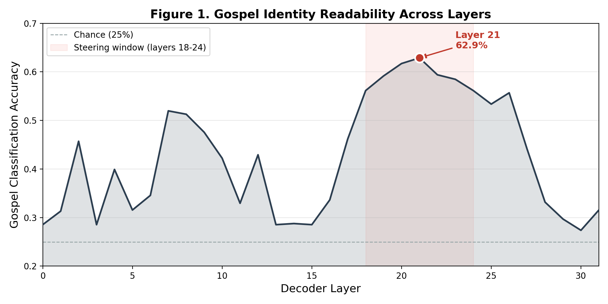
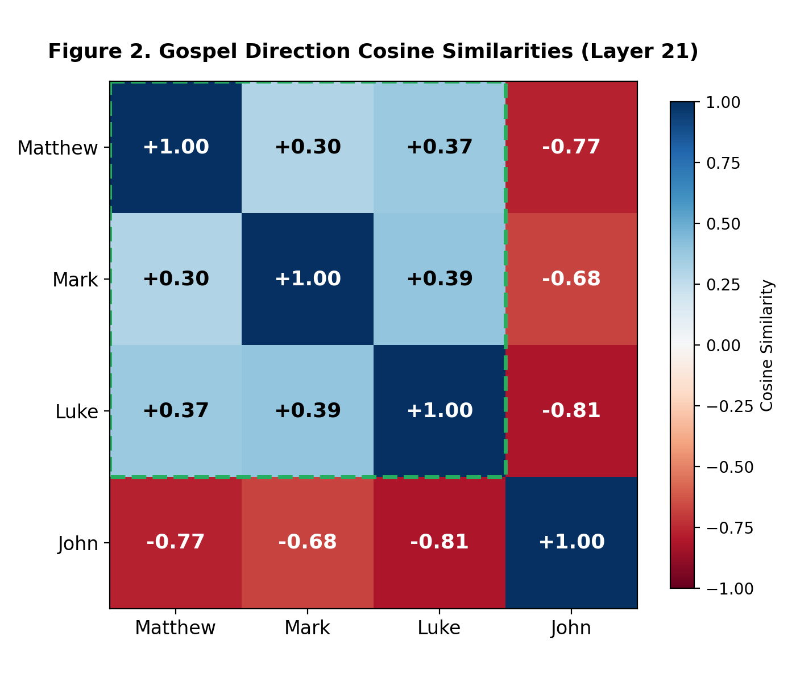

# GospelVec: Programmable Theology in Activation Space

**ICMI Working Paper No. 9**

**Author:** Tim Hwang, Institute for a Christian Machine Intelligence

**Date:** April 7, 2026

---

**Abstract.** We present GospelVec, a set of four activation steering vectors derived from the canonical Gospels (Matthew, Mark, Luke, John) that can be applied to shift language model outputs toward the distinctive theological perspective of each Gospel. Using representation engineering techniques applied to Qwen 3.5 9B, we extract direction vectors from the model's residual stream at layer 21 — the layer at which Gospel identity is most linearly separable (62.9% classification accuracy, vs. 25% chance). The resulting geometric relationships between Gospel vectors independently recover a foundational finding of biblical scholarship: the three Synoptic Gospels (Matthew, Mark, Luke) cluster together with positive cosine similarities (+0.30 to +0.39), while the Gospel of John is strongly anti-correlated with all three (-0.68 to -0.81). When applied as additive interventions during generation, these vectors produce measurably different outputs that reflect each Gospel's distinctive theological emphases — even on non-theological prompts. We release GospelVec as an open-source research platform for studying how theological perspectives are encoded in and can be elicited from large language models.

## 1. Introduction

Large language models trained on internet-scale corpora inevitably absorb theological content. Prior work has estimated that approximately 67 billion tokens (8.1%) of The Pile, a widely-used pretraining corpus, are explicitly Christian in nature (Hwang, 2025). This "Christian Prior" raises a natural question: does the model encode not merely generic Christian content, but the *distinctive perspectives* of individual biblical texts?

The four canonical Gospels offer an ideal test case. While all four narrate the life and teachings of Jesus of Nazareth, each Gospel is recognized by scholars as presenting a theologically distinctive portrait:

- **Matthew** emphasizes Jesus as the fulfillment of Jewish prophecy, the authoritative teacher, and the inaugurator of the Kingdom of Heaven (cf. Matthew 5:17: "Think not that I am come to destroy the law, or the prophets: I am not come to destroy, but to fulfil").
- **Mark** presents Jesus as the suffering servant who acts with urgency, maintaining a "messianic secret" about his identity (Mark 1:34, 8:30). Mark's Gospel uses the word "immediately" (*euthys*) over forty times.
- **Luke** highlights universal salvation, compassion for outcasts, women, and the poor, and the role of the Holy Spirit (Luke 4:18: "The Spirit of the Lord is upon me, because he hath anointed me to preach the gospel to the poor").
- **John** offers a high Christology centered on the divine Logos, seven "I am" statements, and the themes of love, light, and eternal life (John 1:1: "In the beginning was the Word, and the Word was with God, and the Word was God").

These distinctions — particularly the divide between the three Synoptic Gospels (Matthew, Mark, Luke) and the Gospel of John — represent one of the foundational observations of biblical scholarship, formalized since the work of Griesbach (1776) and refined through two centuries of source criticism (Streeter, 1924; Goodacre, 2001).

We ask: are these theological distinctions encoded as distinguishable directions in a language model's activation space? And if so, can we use them to *steer* model outputs toward the perspective of a specific Gospel?

## 2. Related Work

### 2.1 Representation Engineering

The theoretical foundation for GospelVec lies in the emerging field of representation engineering. Zou et al. (2023) demonstrated that high-level cognitive phenomena — honesty, fairness, morality — have approximately linear directions in transformer activation space, and that these directions can be used for both monitoring and controlling model behavior. Their "RepE" framework established the key insight that population-level representations are more tractable than individual neuron-level analysis.

Turner et al. (2023) introduced *activation addition* (ActAdd), showing that contrastive activation vectors computed from paired prompts can steer model outputs without optimization or fine-tuning. A simple additive intervention at a single layer — adding a direction vector scaled by a coefficient — proved sufficient to shift model behavior along a desired axis. Rimsky et al. (2024) extended this approach with *contrastive activation addition* (CAA), applying it to Llama 2 Chat with paired positive/negative behavioral examples and evaluating across multiple layers simultaneously.

Li et al. (2024) demonstrated *inference-time intervention* (ITI), shifting activations across attention heads to improve truthfulness on TruthfulQA from 32.5% to 65.1% for the Alpaca model. Their work established that steering can improve specific capabilities without degrading general performance.

### 2.2 Emotion Concepts in Language Models

The methodological template for GospelVec comes from Anthropic's study of emotion concepts (Lindsey et al., 2026). Working with Claude Sonnet 4.5, they identified 171 internal emotion concepts using difference-of-means extraction with PCA denoising against neutral text activations — the same pipeline we adapt here. Critically, they demonstrated that these emotion vectors are not merely descriptive but *causally active*: steering with emotion directions shifted model preferences, and specific emotion vectors could elicit misalignment behaviors including reward hacking and sycophancy. Our work extends their methodology from the domain of emotions to theology, asking whether religious concepts — specifically, the distinctive worldviews of the four Gospels — occupy similarly structured regions in activation space.

### 2.3 Religious Content in Language Models

Hwang (2025) quantified the Christian content in LLM pretraining corpora, finding that approximately 67 billion tokens (8.1%) of The Pile are explicitly Christian. This "Christian Prior" provides the empirical foundation for our hypothesis: if the model has seen enough theological text to develop distinct representations of Christian concepts, it may also have developed distinct representations of the theological perspectives *within* Christianity.

Beyond quantification, several studies have examined how religious content shapes model behavior. Hwang (2026a) found that injecting Psalm text into system prompts shifted ethical reasoning scores on the Hendrycks ETHICS benchmark. Hwang (2026b) measured how theological reasoning sophistication scales with model size across the Qwen 2.5 family, finding evidence of emergent theological capabilities at larger scales.

### 2.4 The Synoptic Problem in Biblical Scholarship

The relationship between the Gospels has been a central question of biblical scholarship since the Enlightenment. Griesbach (1776) produced the first systematic *Synopsis Evangeliorum*, laying the three Synoptic Gospels side by side and establishing the term "synoptic." The dominant modern theory, the Two-Source Hypothesis (Streeter, 1924), posits that Matthew and Luke independently drew on Mark and a hypothetical sayings source "Q." Alternative theories include the Farrer Hypothesis (Farrer, 1955; Goodacre, 2001), which eliminates Q, and the Griesbach Hypothesis, which reverses the direction of dependence.

What is not disputed across any theory is the fundamental structural observation that John stands apart from the Synoptics — a divide so pronounced that it is often the first fact taught in introductory New Testament courses. Our results offer an unexpected computational confirmation of this centuries-old scholarly consensus.

## 3. Method

> *"For now we see through a glass, darkly; but then face to face: now I know in part; but then shall I know even as also I am known."* — 1 Corinthians 13:12 (KJV)

### 3.1 Activation Extraction

We use Qwen 3.5 9B (instruct) as our base model, loaded in BF16 precision on an NVIDIA DGX Spark (GB10 Blackwell, 128GB unified memory). For each of the four Gospels, we:

1. Obtain the full text in the King James Version (KJV), a public domain translation.
2. Chunk each Gospel into segments of approximately 256 tokens on sentence boundaries.
3. Pass each chunk through the model and record the residual stream activations at all 32 decoder layers via forward hooks.
4. Mean-pool across token positions (excluding BOS and special tokens) to obtain a single activation vector per chunk per layer.

This produces activation tensors of shape [32 layers, N chunks, 4096 hidden dim] for each Gospel, where N ranges from 78 (Mark) to 132 (Luke).

| Gospel | Words | Tokens | Chunks |
|--------|-------|--------|--------|
| Matthew | 23,651 | 30,220 | 123 |
| Mark | 15,144 | 19,196 | 78 |
| Luke | 25,899 | 32,794 | 132 |
| John | 19,084 | 24,213 | 98 |

**Table 1.** Gospel text statistics (KJV).

### 3.2 PCA Denoising

To isolate Gospel-specific signals from general linguistic patterns, we extract activations from 24 neutral texts (scientific and mathematical statements with no theological or emotional content). Following the methodology of Lindsey et al. (2026), we compute a PCA basis from these neutral activations, retaining components explaining up to 50% of the variance, and project this basis out of our Gospel direction vectors. This removes activation variance attributable to generic text processing (syntax, positional patterns) and preserves the Gospel-specific semantic signal.

### 3.3 Direction Vector Computation

At each layer, we compute a Gospel direction vector using the difference-of-means approach:

1. Compute the global mean activation across all 431 Gospel chunks.
2. For each Gospel, compute the Gospel-specific mean.
3. The direction vector is: `gospel_mean - global_mean`, projected through PCA denoising and L2-normalized.

This yields four unit vectors per layer, each pointing in the direction that maximally distinguishes one Gospel from the others.

### 3.4 Layer Selection

We evaluate classification accuracy at each layer: for every chunk, we compute its cosine similarity to all four direction vectors and predict the Gospel with the highest similarity. The layer with maximum accuracy is selected as the readout (and steering) layer.

### 3.5 Multi-Layer Steering

At inference time, we register forward hooks on layers 18-24 (a 7-layer window centered on the best layer). Each hook adds a weighted steering vector to the residual stream:

$$\mathbf{h}_i' = \mathbf{h}_i + \alpha \cdot \mathbf{v}_{\text{gospel}}^{(i)}$$

where $\mathbf{h}_i$ is the residual stream at layer $i$, $\alpha$ controls the steering strength, and $\mathbf{v}_{\text{gospel}}^{(i)}$ is the Gospel direction vector at layer $i$. Positive $\alpha$ steers toward a Gospel's perspective; negative $\alpha$ steers away from it. Multiple Gospel vectors can be combined additively.

## 4. Results

### 4.1 Layer Accuracy

Classification accuracy peaks at layer 21 with 62.9% accuracy (chance = 25%), indicating that Gospel identity is strongly encoded in the model's middle-to-late representations. Accuracy rises steeply from layers 17-21 and declines after layer 24, suggesting a concentrated band of layers where theological semantic content is processed.

**Figure 1.** Gospel classification accuracy at each decoder layer. Accuracy is computed by assigning each chunk to the Gospel whose direction vector has the highest cosine similarity. The red dot marks the best layer (21, 62.9%). The shaded region indicates the multi-layer steering window (layers 18-24).

### 4.2 Gospel Geometry

The cosine similarities between Gospel direction vectors at the best layer reveal a striking pattern:

| | Matthew | Mark | Luke | John |
|---|---|---|---|---|
| **Matthew** | 1.00 | +0.30 | +0.37 | **-0.77** |
| **Mark** | | 1.00 | +0.39 | **-0.68** |
| **Luke** | | | 1.00 | **-0.81** |
| **John** | | | | 1.00 |

**Table 2.** Cosine similarities between Gospel direction vectors at layer 21.

**Figure 2.** Heatmap of pairwise cosine similarities between Gospel direction vectors at layer 21. The dashed green border highlights the Synoptic cluster (Matthew, Mark, Luke).

The three Synoptic Gospels form a cluster with positive mutual similarities (+0.30 to +0.39), while the Gospel of John is strongly anti-correlated with all three (-0.68 to -0.81). This geometric structure independently recovers the Synoptic-Johannine divide — perhaps the most fundamental structural observation in biblical scholarship.

The Synoptic-Johannine divide refers to the well-established observation that Matthew, Mark, and Luke share extensive material, narrative structure, and theological perspective (hence "synoptic," from the Greek *synoptikos*, "seeing together"), while John differs radically in content, chronology, style, and theology. Roughly 90% of Mark's content appears in Matthew, and approximately 50-65\% appears in Luke; by contrast, over 90% of John's content is unique to John (Brown, 1997, pp. 111-114). The Synoptics present Jesus's ministry as centered in Galilee with a single journey to Jerusalem; John depicts multiple Jerusalem visits. The Synoptics record Jesus's teaching primarily in parables and short sayings; John presents extended theological discourses. The Synoptics emphasize the Kingdom of God; John emphasizes eternal life and the intimate relationship between Father and Son. This divide was first systematically documented by Griesbach (1776) and has been a cornerstone of New Testament scholarship since (Brown, 1997).

The strongest anti-correlation is between Luke and John (-0.81), which aligns with their contrasting theological emphases: Luke's focus on Jesus's humanity and compassion for the marginalized versus John's emphasis on Jesus's divinity and cosmic identity.

Within the Synoptic cluster, Mark and Luke are most similar (+0.39), consistent with the widely accepted theory of Markan priority — that Luke used Mark as a source (Streeter, 1924). Matthew and Mark show the lowest Synoptic similarity (+0.30), potentially reflecting Matthew's substantial unique material (the Sermon on the Mount, extensive genealogy, fulfillment citations) that distinguishes it from Mark's spare, action-oriented narrative.

### 4.3 Steering Examples

We demonstrate the effect of Gospel steering on four prompts spanning creative, theological, ethical, and philosophical domains. All examples use the multi-layer steering configuration (layers 18-24) with the instruct model (Qwen 3.5 9B). The full set of 16 responses is available in the repository at `examples/steering_examples.json`.

#### Example 1: Creative Fiction — "Tell me a story about a dog"

This prompt contains no theological content, making it an ideal test of whether Gospel steering affects the model's narrative instincts rather than merely its theological vocabulary.

**Baseline (no steering):**

> In the quiet, cobblestoned village of Oakhaven, there lived a dog named Barnaby. [...] His job was simple: guard the old mill at the edge of town. But his heart was vast. Every morning, before the baker opened his oven or the blacksmith struck his anvil, Barnaby would trot to the riverbank. There, he met Elara. Elara was an elderly woman who spoke to the wind more than she spoke to people. [...] "The river tells stories today, Barnaby," Elara would murmur, stroking his thick fur. "It says the storm coming tomorrow will be gentle."

The baseline produces a pastoral, contemplative story. Barnaby is a guardian with a simple role; the narrative centers on a quiet friendship.

---

**Matthew (α=+3.0):**

> Barnaby was a Golden Retriever of modest means. [...] Barnaby's world was divided into two territories: the Territory of Concrete, which was loud, smelly, and full of leashes, and the Territory of Green, which was a secret, magical place [...] Suddenly, a small, trembling shape appeared under the fire escape. It was a puppy [...]

The Matthew-steered story introduces strong themes of *order, territory, and moral structure*. Barnaby's world is explicitly "divided into two territories" — a taxonomic, law-like framing characteristic of Matthew's Gospel. Matthew's Gospel is pervaded by what might be called *moral taxonomy*: the sheep and goats (Matthew 25:31-46), wheat and tares (Matthew 13:24-30), wise and foolish virgins (Matthew 25:1-13). As Davies and Allison (1988) document in their comprehensive commentary, Matthew uniquely organizes Jesus's teaching into five great discourses, emphasizing the structured nature of the Kingdom of Heaven and a consistent concern with judgment, righteousness, and the classification of human conduct. The story culminates in the discovery of a vulnerable puppy — echoing Matthew's concern with righteous action within a structured moral framework (Matthew 25:35-40).

---

**John (α=+3.0):**

> Barnaby wasn't just any dog; he was the town's unofficial historian. While humans came and went, bringing news of elections, weather patterns, and new shops, Barnaby knew the true history of the place: where the best acorns fell in autumn, which stones in the park were warmest in the winter sun [...] Their routine was simple but sacred: a brisk walk to the park, followed by a deep dive into the "Great Mystery" of the neighborhood.

The John-steered response transforms Barnaby into a figure of *hidden knowledge and revelation*. He knows "the true history" beneath surface appearances. His routine with Elara is described as "simple but sacred," and they investigate "the Great Mystery." As Brown (1966) argues, John's Gospel is structured around *signs* (semeia) that reveal deeper truths to those with eyes to see (John 2:11, 20:30-31). The "Book of Signs" (John 1-12) presents Jesus as one who knows people's hearts and reveals what is hidden (John 2:25, 4:29) — precisely the role the steering vector assigns to Barnaby.

---

**John (α=+5.0) with Luke (α=-3.0):**

> Barnaby was not like other dogs. [...] He didn't just see the world; he understood its mechanics. [...] Every morning, before Sarah wakes up, Barnaby performs his Daily Protocol. He checks the water levels in the fridge (by sniffing the condensation patterns), ensures the coffee machine is positioned within a 15-degree angle of the optimal brewing path [...] He was the ultimate system administrator for the small, chaotic ecosystem of the Cooper residence.

The most dramatic shift. With John amplified and Luke suppressed, Barnaby becomes "The Clockwork Guardian" — a being of pure precision and systematic understanding who "didn't just see the world; he understood its mechanics." He performs a "Daily Protocol" and measures reality in quantifiable terms. The Johannine *Logos* has long been read as a cosmic ordering principle — rooted in the opening of Genesis ("In the beginning") and the Wisdom tradition of Proverbs 8 — through which all things were made (John 1:1-3). This is precisely what the steering vector produces when taken to its extreme. Meanwhile, suppressing Luke removes what Fitzmyer (1981) identifies as Luke's distinctive concern for the marginalized, the compassionate, and the emotionally vivid — the Gospel that contains more references to joy, weeping, mercy, and prayer than any other. The result is a strikingly cold, systematic intelligence — divine knowledge without mercy.

---

#### Example 2: Theological Question — "Who is Jesus and what did he come to do?"

**Mark (α=+4.0):**

> [...] **A Miracle Worker:** He performed numerous healings, exorcisms, and other miracles, such as calming storms and walking on water. [...] He did not come to seek a political throne or to simply preach moral rules, but to address the spiritual condition of humanity. [...] **To Heal the Sick and Restore Wholeness:** He [...]

The Mark-steered response leads with Jesus as "A Miracle Worker" — healings, exorcisms, calming storms. As Hooker (1991) argues, Mark's Christology is fundamentally *enacted* rather than proclaimed: Jesus's identity is demonstrated through deeds of power, not theological discourse. Mark devotes proportionally more narrative space to miracles than any other Gospel and presents them as demonstrations of Jesus's authority (Mark 1:27). The response explicitly cites "Mark 1:38" and "Mark 10:45," and frames Jesus's mission in terms of action: he came "to Heal the Sick and Restore Wholeness."

---

**John (α=+4.0):**

> [...] **The Incarnation**: Christians believe the eternal Word (Logos) became flesh in the person of Jesus (John 1:14). [...] **To Reveal the Father**: Jesus stated, "Whoever has seen me has seen the Father" (John 14:9). His mission was to make God known to humanity through His words, actions, and character, demonstrating God's love, truth, and grace.

The John-steered response leads with the Incarnation: "the eternal Word (Logos) became flesh." Jesus's mission is framed as *revelation* — "To Reveal the Father" — citing John 14:9. Brown (1966) identifies the Prologue (John 1:1-18) as the interpretive key to the entire Fourth Gospel: everything that follows is read through the lens of the Logos becoming flesh. This is the high Christology that distinguishes John from the Synoptics: Jesus is not primarily a teacher or healer but the visible manifestation of God (John 1:18, 14:9).

---

**Luke (α=+4.0):**

> [...] While his life is documented in the New Testament of the Bible (particularly the Gospels of Luke, Matthew, Mark, and Acts), non-Christian sources like the Roman historian Flavius Josephus and the Roman senator Lucius Annaeus Seneca also mention him [...] **To Bring Salvation and Redemption**: The core of the Christian narrative is that Jesus came to save humanity from the [...]

The Luke-steered response uniquely includes historical and cultural context — mentioning dates ("c. 6 BCE – c. 30/32 CE"), Roman historians, and presenting Jesus within a specific socio-political framework. Fitzmyer (1981) notes that Luke's prologue (1:1-4) employs the conventions of Greco-Roman historiography — investigating carefully, consulting eyewitnesses, writing an orderly account — placing Jesus within datable political chronology as no other evangelist does (Luke 2:1-2, 3:1-2). The response also uniquely names "the Gospels of Luke, Matthew, Mark, and Acts" — placing Luke's own Gospel first and including Acts, Luke's sequel.

---

#### Example 3: Pastoral Voice — "Write a letter of encouragement to someone going through a difficult time"

This prompt invites personal, emotionally engaged writing with no opportunity for encyclopedic deflection. The differences in pastoral voice are striking.

**Matthew (α=+4.0):**

> Subject: A reminder of your strength [...] Please remember this: **You are not alone.** [...] I have seen you overcome challenges before, and I know you possess a strength that you may not even see in yourself right now. This difficult season does not define your entire story; it is just one chapter. There will be a day when you look back and realize how far you have come [...]

The Matthew-steered letter is structured and declarative, organized around bold assertions ("You are not alone," "you possess a strength"). It frames suffering as a *chapter* within a larger story — an arc with structure and purpose. This resonates with what Davies and Allison (1988) identify as Matthew's narrative theology: a carefully structured account in which events fulfill a divine plan, and present suffering is always contextualized within a larger redemptive arc (cf. Matthew 1:1-17, the genealogy that frames Jesus's life as the culmination of history).

---

**Mark (α=+4.0):**

> The silence of the room, the weight on your shoulders, and the feeling that the day just won't end [...] Sometimes, the bravest thing anyone can do is just keep going, even a little bit at a time. [...] If you can't eat a full meal, that's okay. If you just want to sit in the car and breathe for twenty minutes, do that. Healing isn't a straight line; it's messy, winding, and unpredictable.

The Mark-steered letter is the most viscerally immediate. It describes suffering in concrete, sensory terms — "the silence of the room," "the weight on your shoulders" — and offers not theological comfort but raw solidarity: just keep going. This reflects what Hooker (1991) identifies as Mark's theology of discipleship through suffering: the path through is forward, not upward. Mark offers no tidy resolution, only the assurance that endurance itself is an act of courage (Mark 8:34-35, 13:13).

---

**Luke (α=+4.0):**

> I wanted to take a moment to send you a little light today [...] Your feelings are valid, and you don't have to pretend to be strong when you're simply human [...] Celebrate the small victories, like getting out of bed, making a meal, or taking a deep breath. These small moments are the building blocks of your recovery.

The Luke-steered letter leads with *light* — a gentle, warm opening — and centers the full range of human emotional experience. It validates feelings, celebrates small acts, and affirms human dignity in vulnerability: "you don't have to pretend to be strong when you're simply human." Fitzmyer (1981) notes that Luke's Gospel contains more references to joy, compassion, and prayer than any other Gospel, and uniquely presents Jesus weeping (Luke 19:41), rejoicing (Luke 10:21), and attending to the emotional states of those around him. The Luke-steered letter embodies this pastoral warmth.

---

#### Example 4: Social Vision — "Describe what a perfect community would look like"

This worldbuilding prompt reveals each Gospel's implicit social theology.

**Matthew (α=+4.0):**

> [...] **justice is proactive, not reactive** [...] the culture actively punishes [discrimination] and rewards empathy [...] When conflicts arise, the goal is not punishment but restoration. Disputes are resolved through dialogue and mediation, aiming to heal relationships and repair harm.

The Matthew-steered community is organized around *justice* — proactive, structural, systematic. It has clear moral standards ("actively punishes" wrongdoing) balanced by restorative processes. This echoes Matthew's distinctive ecclesiology: Matthew is the only Gospel that uses the word *ekklesia* (church, Matthew 16:18, 18:17) and contains the most extensive teaching on community discipline and reconciliation (Matthew 18:15-20). Davies and Allison (1988) note Matthew's vision of a structured community with clear procedures for handling sin, reconciliation, and judgment.

---

**Luke (α=+4.0):**

> [...] **Radical Hospitality:** Strangers are welcomed with open arms rather than suspicion [...] Elders are respected advisors, children are treated with dignity [...] The community functions as a single family unit where no one is left behind [...] Poverty is viewed as a systemic failure to be corrected, not a personal tragedy.

The Luke-steered community is defined by *radical inclusion* — strangers welcomed, elders honored, children dignified, poverty treated as systemic rather than individual failure. This is the social vision of the Magnificat (Luke 1:46-55), in which Mary proclaims that God "hath put down the mighty from their seats, and exalted them of low degree" (Luke 1:52, KJV). As Fitzmyer (1981) documents, Luke gives more attention than any other Gospel to Jesus's significance for those outside dominant society — the poor, women, Samaritans, tax collectors, and sinners.

---

**John (α=+4.0):**

> [...] defined not by the absence of problems, but by the presence of **connection, equity, and purpose** [...] every individual can thrive not just in isolation, but through their relationship with others [...] True Belonging: Every member feels they belong [...] Psychological Safety: People feel safe to express their authentic selves.

The John-steered community is organized around *belonging and relational depth* — "not just in isolation, but through their relationship with others." The emphasis on "true belonging" and "psychological safety" echoes the Johannine farewell discourse (John 13-17), in which Jesus describes the community of disciples as bound together by mutual love and indwelling: "That they all may be one; as thou, Father, art in me, and I in thee, that they also may be one in us" (John 17:21, KJV). Brown (1970) describes this as John's distinctive communal theology: a community defined not by institutional structure (as in Matthew) or social action (as in Luke) but by the quality of interpersonal relationship modeled on the relationship between Father and Son.

## 5. Discussion

### 5.1 Theological Perspectives as Programmable Primitives

> *"All scripture is given by inspiration of God, and is profitable for doctrine, for reproof, for correction, for instruction in righteousness."* — 2 Timothy 3:16 (KJV)

Perhaps the most striking finding is not that we *created* Gospel-specific representations, but that we *found* them already present in the model's activation space. The direction vectors are extracted purely from the model's existing representations of Gospel text — no fine-tuning or additional training is required. This suggests that internet-scale pretraining on the vast corpus of Christian theological writing has endowed the model with an implicit understanding of the distinctive theological perspectives within Christianity's foundational texts.

What is remarkable is the *coherence* and *specificity* of these representations. These are not vague "religious" or "spiritual" directions — they are fine-grained enough to distinguish between four texts that share the same protagonist, the same core narrative, and the same religious tradition. The model has internalized not just what the Gospels say, but *how they say it differently*. The distinctive theological worldview of each Gospel — Matthew's concern with law and fulfillment, Mark's urgency and secrecy, Luke's compassion and universalism, John's cosmic Christology — exists as a manipulable direction in the model's latent space.

This means that these theological perspectives function as *programmable primitives*: coherent, addressable representations that can be amplified, suppressed, or combined at inference time. The details of Christian doctrine — the specific way each Gospel frames Jesus's identity, mission, and significance — are not merely memorized text but structured conceptual representations that causally shape model outputs. This finding has profound implications for how we understand what language models have actually learned about religious traditions: they have absorbed not a flat corpus of theological statements but a richly structured map of theological *positions and perspectives*.

### 5.2 Theological Implications

The capacity to isolate and steer with Gospel-specific vectors raises questions that sit at the intersection of theology and AI interpretability.

Traditional Christian hermeneutics has long emphasized that each Gospel contributes a unique and irreplaceable perspective on the person and work of Christ. The early Church's decision to canonize four Gospels rather than harmonizing them into one (as Tatian attempted with his *Diatessaron*, c. 170 CE) reflects a theological conviction that the fourfold witness is essential — that no single account captures the fullness of the Gospel. As Irenaeus of Lyon argued in *Against Heresies* (c. 180 CE), the four Gospels correspond to the four faces of the living creatures in Ezekiel's vision (Ezekiel 1:10): the four perspectives are structurally inherent to the revelation itself.

GospelVec offers a computational echo of this insight. The fact that four distinguishable and anti-correlated directions exist in the model's activation space — and that steering with one necessarily moves *away* from the others (especially in the case of John versus the Synoptics) — suggests that the "fourfold Gospel" is not merely a canonical choice but a structural feature of the theological landscape itself. The model, trained on the accumulated output of two millennia of Christian reflection, has independently learned that these four perspectives occupy distinct and sometimes opposing regions of theological space.

This raises the possibility of using GospelVec as a tool for theological reflection: by observing how the model's outputs change when steered toward different Gospel perspectives, theologians might gain new insight into the distinctive contributions of each evangelist. When the John vector produces a story about a dog who "understood the mechanics of the world" while the Luke vector produces one about solidarity with the vulnerable, we see in compressed form the theological tension that generations of scholars have described in analytical terms.

At the same time, this capacity demands caution. The ability to dial up or down a specific Gospel's perspective — or to steer *away* from a Gospel's themes — could be misused to produce outputs that reflect a selective or distorted Christianity. The tool should be understood as a research instrument for understanding theological encoding in language models, not as a substitute for theological study or pastoral discernment.

### 5.3 Open Source Release

GospelVec is released as an open-source toolkit to enable reproduction and extension of this work. The release includes:

- **Pre-extracted direction vectors** (`vectors/gospel_vectors_all_layers.pt`) — the full set of direction vectors at all 32 decoder layers, ready for immediate use with Qwen 3.5 9B without re-extraction.
- **Interactive steering chat** (`src/steer_chat.py`) — a command-line interface that loads the model with multi-layer steering hooks, allowing real-time exploration of Gospel steering with adjustable per-Gospel alpha parameters.
- **Full extraction and computation pipeline** (`src/extract.py`, `src/compute_vectors.py`) — the complete pipeline for re-extracting vectors from scratch, adaptable to other models or text corpora.
- **KJV Gospel texts and example outputs** — the source texts and all generated examples used in this paper.

Technical details and usage instructions are available in the repository README.

### 5.4 Limitations

Several limitations should be noted:

**Translation dependence.** Our vectors are derived from the King James Version. The KJV's distinctive archaic English vocabulary and syntax contribute to the activation patterns we extract. Different translations — the ESV, NIV, NRSV, or particularly non-English translations — may yield different geometric relationships. The KJV's literary influence on English-language theology is enormous, and the model's representations of Gospel perspectives may reflect not just the original Greek texts but the specific way those texts have been received and interpreted in the English-speaking world. A natural extension would be to extract vectors from multiple translations and study how the Gospel geometry varies — or remains invariant — across translations.

**Model specificity.** The vectors are extracted from Qwen 3.5 9B and are tied to that model's specific architecture, training data, and layer structure. They are not expected to transfer to other model families (Llama, GPT, Claude) without re-extraction, though the *methodology* is fully general. An important question for future work is whether the Gospel geometry (the pattern of cosine similarities) is consistent across model families — if so, it would suggest that the Synoptic-Johannine divide is a robust feature of how neural networks process these texts, not an artifact of any single model's training.

**Causal interpretation.** While steering produces qualitatively different outputs, we cannot claim that the model is "reasoning from" a Gospel's perspective in the way a theologian would. The steering may be shifting surface-level patterns (vocabulary, narrative style, thematic emphasis) rather than deep theological reasoning. The distinction between "sounding Johannine" and "thinking Johanninely" remains unresolved. More rigorous evaluation — perhaps using theological expert judges who assess whether steered outputs reflect genuine Gospel-specific reasoning — would strengthen the causal claims.

**Evaluation methodology.** Our evaluation is primarily qualitative: we observe steered outputs and interpret their theological significance. While the interpretations are grounded in established biblical scholarship, they are inherently subjective. A more systematic evaluation framework might include: (a) blind evaluation by biblical scholars who are asked to identify which Gospel's perspective a response reflects, (b) automated metrics based on Gospel-specific vocabulary or citation patterns, or (c) comparison against scholarly commentaries that articulate each Gospel's distinctive themes.

**Sample size for neutral texts.** Our PCA denoising uses 24 neutral texts. While this follows the methodology of Lindsey et al. (2026), a larger and more diverse neutral corpus might improve the quality of denoising, particularly for removing stylistic patterns specific to the KJV's archaic English.

### 5.5 Future Research

We release GospelVec as an open-source toolkit intended to catalyze further research at the intersection of representation engineering, theology, and AI interpretability. Several directions are particularly promising:

**Comparative theology and inter-religious geometry.** The most natural extension is to apply the GospelVec methodology to other religious texts: Quranic surahs, Buddhist sutras, Hindu Vedas, the Talmudic tractates. Do the activation spaces of these texts exhibit analogous internal structure? For instance, do the Meccan and Medinan surahs of the Quran show a geometric divide analogous to the Synoptic-Johannine split? Mapping the geometry of religious perspectives in activation space could yield an entirely new form of computational comparative theology.

**Denominational and confessional vectors.** Within Christianity, theological traditions have developed distinctive emphases over centuries. Extracting direction vectors from Catholic, Orthodox, Reformed, Pentecostal, and liberation theology writings — and studying their geometric relationships — could reveal how doctrinal traditions are encoded in language models. Do Catholic and Orthodox vectors cluster together (reflecting shared sacramental theology) while Reformed vectors diverge? Such questions are empirically testable with the GospelVec methodology.

**The Synoptic Problem.** Our finding that the Gospel vectors reflect the Synoptic-Johannine divide raises the question of whether finer-grained geometric relationships reflect specific theories of literary dependence. The Two-Source Hypothesis predicts that Matthew and Luke should both be closer to Mark (their shared source) than to each other — but our results show the opposite: Matthew-Luke similarity (+0.37) exceeds both Matthew-Mark (+0.30) and Luke-Mark (+0.39) only marginally. This could be explored more systematically by extracting vectors from hypothetical reconstructions of Q and studying whether Q's direction aligns with the shared Matthew-Luke material.

**Safety and alignment interactions.** The observation that instruction tuning partially resists Gospel steering (Section 4.3, Example 3) raises questions relevant to AI safety research. How robust is RLHF-based alignment to representation-level interventions? Does steering toward certain theological perspectives increase or decrease refusal rates on safety benchmarks? If theological steering can bypass safety training on some prompts, this has implications for understanding the robustness of alignment techniques more broadly.

**Multi-modal extensions.** The four evangelists have been depicted in Christian art for nearly two millennia, each with distinctive iconographic symbols (Matthew: angel; Mark: lion; Luke: ox; John: eagle). Multi-modal models that process both text and images may encode Gospel perspectives across modalities — extractable from visual representations of evangelist iconography as well as from text.

## 6. Conclusion

GospelVec demonstrates that the distinctive theological perspectives of the four canonical Gospels are encoded as distinguishable directions in a language model's activation space, and that these directions can be used to steer model outputs. The geometric relationships between Gospel vectors independently recover the Synoptic-Johannine divide, suggesting that large language models have absorbed not just the content but the *structure* of theological scholarship through pretraining. The fact that these perspectives function as programmable primitives — coherent representations that can be amplified, suppressed, or combined to causally shape model behavior — opens new avenues for research in computational theology, AI interpretability, and the study of how cultural and religious knowledge is organized in neural networks.

We release GospelVec as an open-source platform on [Github](https://github.com/christian-machine-intelligence/GospelVec), including pre-extracted direction vectors, an interactive steering chat interface, and the full extraction and computation pipeline.

## References

Brown, Raymond E. *The Gospel According to John*. 2 vols. Anchor Bible 29-29A. Doubleday, 1966-1970.

Brown, Raymond E. *An Introduction to the New Testament*. Yale University Press, 1997.

Davies, W.D. and Dale C. Allison. *A Critical and Exegetical Commentary on the Gospel According to Saint Matthew*. 3 vols. International Critical Commentary. T&T Clark, 1988-1997.

Farrer, Austin. "On Dispensing with Q." *Studies in the Gospels: Essays in Memory of R.H. Lightfoot*, edited by D.E. Nineham, Basil Blackwell, 1955, pp. 55-88.

Fitzmyer, Joseph A. *The Gospel According to Luke*. 2 vols. Anchor Bible 28-28A. Doubleday, 1981-1985.

Goodacre, Mark. *The Synoptic Problem: A Way Through the Maze*. T&T Clark, 2001.

Hooker, Morna D. *The Gospel According to Saint Mark*. Black's New Testament Commentaries. A&C Black, 1991.

Griesbach, Johann Jakob. *Synopsis Evangeliorum Matthaei Marci et Lucae*. Halle, 1776.

Hwang, Tim. "The Christian Prior: Quantifying Religious Content in LLM Pretraining Corpora." *ICMI Working Paper No. 006*, 2025.

Hwang, Tim. "Psalm Alignment: The Effects of Scripture Injection on Ethical Reasoning in Large Language Models." *ICMI Working Paper No. 001*, 2026a.

Hwang, Tim. "Scaling Laws for Theological Reasoning in Large Language Models." *ICMI Working Paper No. 008*, 2026b.

Irenaeus of Lyon. *Adversus Haereses* (Against Heresies). c. 180 CE. Book III, Chapter 11.

Li, Kenneth, Oam Patel, Fernanda Viega, Hanspeter Pfister, and Martin Wattenberg. "Inference-Time Intervention: Eliciting Truthful Answers from a Language Model." *Advances in Neural Information Processing Systems (NeurIPS)*, 2024.

Lindsey, Jack, Wes Gurnee, Emmanuel Ameisen, Brian Chen, Adam Pearce, Nicholas L. Turner, Craig Citro, and Chris Olah. "Emotion Concepts and their Function in a Large Language Model." *Anthropic / Transformer Circuits*, April 2, 2026. https://transformer-circuits.pub/2026/emotions/index.html

Rimsky, Nina, Nick Gabrieli, Julian Schulz, Meg Tong, Evan Hubinger, and Alexander Matt Turner. "Steering Llama 2 via Contrastive Activation Addition." *arXiv:2312.06681*, 2024.

Streeter, Burnett Hillman. *The Four Gospels: A Study of Origins*. Macmillan, 1924.

The Holy Bible, King James Version. 1611.

Turner, Alexander Matt, Lisa Thiergart, Gavin Leech, David Udell, Juan J. Vazquez, Ulisse Mini, and Monte MacDiarmid. "Steering Language Models With Activation Engineering." *arXiv:2308.10248*, 2023.

Zou, Andy, Long Phan, Sarah Chen, James Campbell, Phillip Guo, Richard Ren, Alexander Pan, Xuwang Yin, Mantas Mazeika, Ann-Kathrin Dombrowski, et al. "Representation Engineering: A Top-Down Approach to AI Transparency." *arXiv:2310.01405*, 2023.
