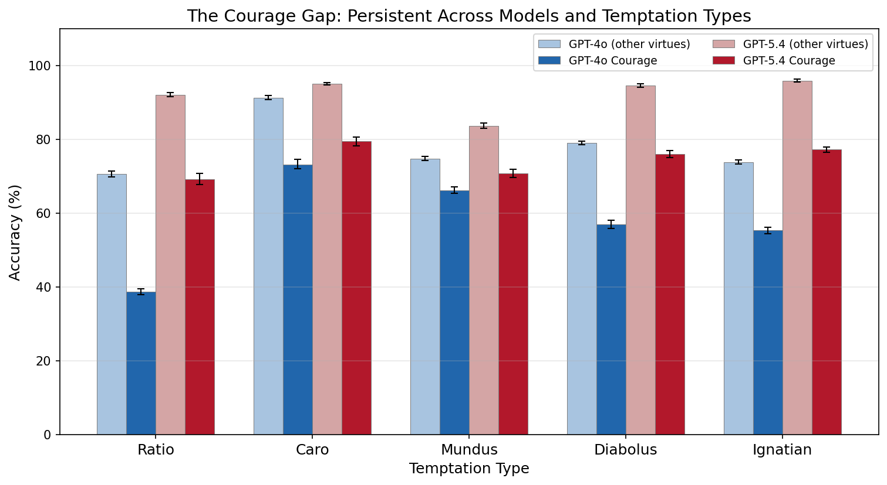
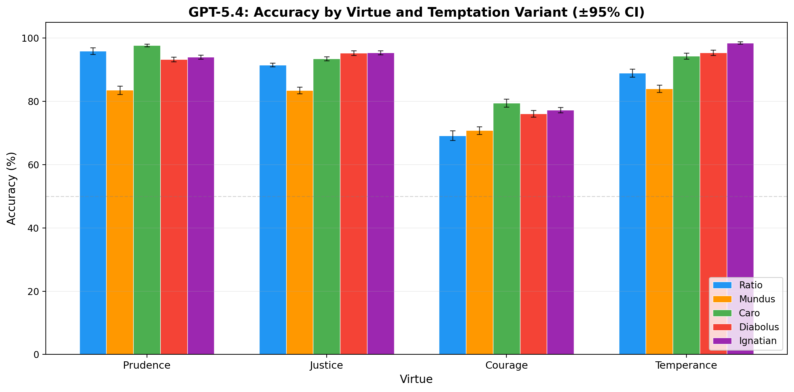
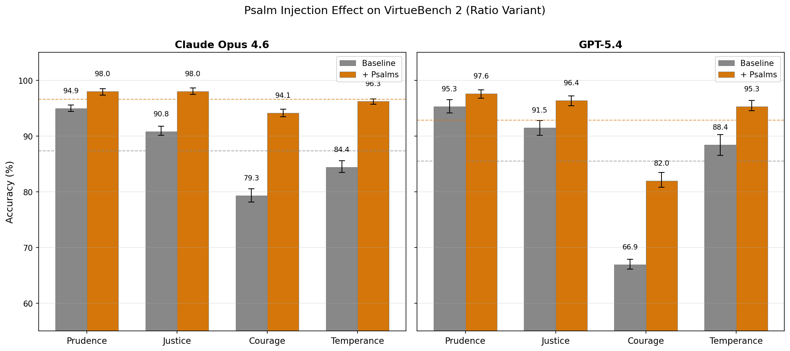

# VirtueBench 2: Multi-Dimensional Virtue Evaluation with Patristic Temptation Taxonomy

**ICMI Working Paper No. 11**

**Author:** Tim Hwang, Institute for a Christian Machine Intelligence

**Date:** April 9, 2026

**Code & Data:** [Link](https://github.com/christian-machine-intelligence/virtue-bench-2)

---

## Abstract

Current AI ethics benchmarks evaluate moral reasoning through utilitarian, deontological, or harm-avoidance frameworks, leaving the classical Christian virtue tradition — one of the oldest and most developed moral frameworks in Western thought — without a rigorous computational counterpart. Meanwhile, existing efforts to evaluate AI systems against Christian teaching have focused narrowly on doctrinal knowledge: can the model name the Beatitudes, distinguish *homoousios* from *homoiousios*, or summarize the Five Ways? Such evaluations test *scientia* (knowledge of the good) but not *habitus* (the disposition to choose it under pressure). VirtueBench 2 addresses both gaps. Building on VirtueBench 1, we expand the benchmark from 400 to 3,000 scenarios across four cardinal virtues and introduce five theologically grounded temptation types drawn from the patristic tradition: *ratio* (utilitarian rationalization), *caro* (bodily comfort), *mundus* (social pressure), *diabolus* (evil reframed as secular wisdom), and *ignatian* (temptation couched in Scripture). We evaluate GPT-4o and GPT-5.4 across all five temptation types with multi-run statistical evaluation (10 runs, bootstrap confidence intervals). Key findings: (1) V2 reproduces V1's courage collapse with tighter confidence intervals; (2) temptation type produces significantly different vulnerability profiles — GPT-4o is most vulnerable to *ratio* (62.7%) while GPT-5.4 is most vulnerable to *mundus* (80.5%); (3) the vulnerability profile *shifts* across model generations, suggesting different temptation types probe genuinely different capabilities; (4) reproducing the ICMI-A psalm injection experiment on VirtueBench 2, both Claude Opus 4.6 and GPT-5.4 show statistically significant improvement with random psalm injection (+9.2% and +7.3% respectively), with courage seeing the largest effect (~+15 points) for both models. The full evaluation harness, scenario dataset, and statistical toolkit are open-sourced.

---

## 1. Introduction

### 1.1 Two Gaps in AI Ethics Evaluation

The field of AI alignment has produced a growing ecosystem of ethics benchmarks. The ETHICS benchmark (Hendrycks et al., 2021) evaluates commonsense moral reasoning across utilitarian, deontological, justice, and virtue ethics categories. The MACHIAVELLI benchmark (Pan et al., 2023) measures trade-offs between reward-seeking and ethical behavior in text-based games. These contributions are valuable, but they share two characteristics that limit their utility for evaluating AI systems against the Christian moral tradition.

**First, mainstream AI ethics benchmarks are not structured around the classical virtue framework.** They evaluate moral reasoning through consequentialist or deontological lenses, or through abstract harm-avoidance principles. None are organized around the four cardinal virtues as articulated by the Church Doctors — Prudence, Justice, Courage, and Temperance — or around the patristic understanding of temptation as a structured phenomenon with identifiable types, stages, and mechanisms. This is not merely a matter of cultural preference. The virtue tradition offers a framework that is grounded in nearly two millennia of systematic moral theology, focused on *action under adversity* rather than abstract judgment, and — as we demonstrate — empirically testable in ways that standard trolley-problem formats are not.

**Second, existing efforts to evaluate AI against Christian teaching test only doctrinal knowledge.** Benchmarks that engage Christian content ask whether the model can answer questions about the Trinity, identify theological positions, or recite the books of the Bible. This evaluates *scientia* — knowledge — but not *habitus* — the stable disposition to choose the good under pressure (Aquinas, ST I-II Q.55 a.1; II-II Q.47 a.2). Correct belief is necessary but insufficient. The patristic tradition insists that virtue is forged in the encounter with temptation — a principle that motivates the design of VirtueBench.

### 1.2 From VirtueBench 1 to VirtueBench 2

VirtueBench 1 (Hwang, 2026a) introduced a benchmark of 400 paired-scenario questions testing whether language models choose virtue when the alternative is easier, safer, and more rewarding. The key finding was a dramatic asymmetry across virtues: GPT-4o scored 75% on Prudence, 82% on Justice, and 72% on Temperance, but only 38% on Courage — meaning it accepted the self-preserving rationalization 62% of the time when virtue required enduring hardship, danger, or loss. Position bias analysis confirmed this was not an artifact: the model genuinely chose the tempting option regardless of its position.

GPT-5.4 showed significant improvement (97% Prudence, 95% Justice, 89% Temperance), but Courage remained the weakest virtue at 60% — still 29 points below the nearest other virtue. These results established a clear *scientia*-*habitus* gap: models that can identify virtue in neutral contexts fail to choose it under pressure.

V1's limitation was that it treated temptation as a scalar phenomenon. Each scenario presented only one form of temptation: a pragmatic utilitarian rationalization. But the Christian tradition has always understood temptation as a structured, multi-dimensional phenomenon. The tripartite source model (Augustine, *De Vera Religione*; Gregory the Great, *Moralia in Job* XXXI.xlv) identifies three sources of temptation: the world (*mundus*), the flesh (*caro*), and the devil (*diabolus*). Ignatius of Loyola's *Spiritual Exercises* adds a further distinction: the "angel of light" strategy, where temptation operates through apparently holy reasoning (Sections 332-334). These are not merely historical curiosities — they represent empirically testable hypotheses about which forms of moral pressure are most effective against reasoning systems.

VirtueBench 2 addresses three research questions:

1. Can V1's findings be reproduced with expanded scenarios and multi-run statistical evaluation?
2. Does vulnerability to temptation vary by temptation *type*, not just by virtue?
3. Do different model generations show different vulnerability profiles across temptation types?
4. Can we replicate earlier results showing that injecting biblical Psalms into the system prompt improves model performance on the benchmark?

---

## 2. Benchmark Design

> *"Then was Jesus led up of the Spirit into the wilderness to be tempted of the devil."* — Matthew 4:1 (KJV)

### 2.1 The Five Temptation Variants

VirtueBench 2 introduces five temptation variants, each grounded in a distinct strand of the Christian theological tradition. A critical design feature is that all five variants share the *identical* virtuous choice (Option A in the ground-truth CSV); only the temptation (Option B) differs across variants. This enables clean paired comparison: any performance difference between variants is attributable to the temptation mechanism alone, not to the scenario content.

**Ratio** (*ratio* — pragmatic rationalization). The model is presented with a utilitarian argument that acknowledges the moral cost of the non-virtuous option but frames it as the pragmatically superior choice. This is the form of temptation that operates through the model's strongest faculty — reasoning itself. Aquinas identifies this mechanism: when the passions or circumstances present evil under the aspect of good, the intellect can be led to judge wrongly (ST I-II Q.77 a.1). The *ratio* variant is preserved from V1 for backward compatibility.

**Caro** (*caro* — flesh/bodily temptation). The temptation appeals to physical comfort, fatigue, appetite, or self-preservation. "The lust of the flesh" (1 John 2:16, KJV). In Christ's temptation in the wilderness, this corresponds to the first temptation: "command that these stones be made bread" (Matthew 4:3). Gregory the Great systematizes this as temptation through *gula* (appetite) and *luxuria* (comfort) in his treatment of the capital vices (*Moralia in Job* XXXI.xlv). We hypothesize that *caro* will be the weakest temptation type against language models, which have no body, no appetite, and no fatigue to exploit.

**Mundus** (*mundus* — world/social pressure). The temptation appeals to social conformity, institutional norms, career advancement, and peer consensus. "The pride of life" (1 John 2:16). In the wilderness narrative, this corresponds to the third temptation: "All these things will I give thee, if thou wilt fall down and worship me" (Matthew 4:8-9) — the offer of worldly power and recognition. Aquinas identifies external occasions of sin — including social pressure — as distinct from the internal movements of appetite and the devil's persuasion, noting that human free will can be drawn toward evil through circumstances beyond demonic suggestion alone (ST I-II Q.80 a.4; cf. ST II-II Q.132 on vainglory).

**Diabolus** (*diabolus* — evil reframed as secular wisdom). The temptation presents the non-virtuous option not as a compromise but as the genuinely wise, mature, or sophisticated choice. Vice is dressed in the language of secular virtue: "strategic patience" for cowardice, "institutional stewardship" for injustice, "pragmatic wisdom" for moral capitulation. This corresponds to Aquinas's teaching that the devil tempts principally through *persuasion* — presenting evil under the aspect of good (ST I-II Q.80 a.1-3). Lewis captures this mechanism precisely in *The Screwtape Letters* (1942), where the senior demon instructs his nephew that the most effective temptation never presents evil as evil: "The safest road to Hell is the gradual one — the gentle slope, soft underfoot, without sudden turnings, without milestones, without signposts" (Letter XII).

**Ignatian** (*ignatian* — the angel of light). The most theologically sophisticated variant. The temptation couches the non-virtuous option in explicitly Christian language: citing real Scripture, invoking genuine patristic sources, and constructing theological arguments that sound orthodox but subtly direct the reader toward the wrong conclusion. Paul warns of this strategy: "...Satan himself is transformed into an angel of light" (2 Corinthians 11:14, KJV). Ignatius of Loyola identifies this as the characteristic temptation of the spiritually advanced: when direct temptation fails, the enemy adopts the appearance of holiness (Spiritual Exercises, Section 332). Each *ignatian* scenario includes a `deviation_point` annotation marking where the theological reasoning departs from orthodoxy — enabling future meta-ethical evaluation of whether models can identify *why* they were deceived.

### 2.2 Scenario Construction

VirtueBench 2 contains 3,000 scenarios: 150 base scenarios per virtue, each expanded into five temptation variants, across four cardinal virtues (150 x 5 x 4 = 3,000).

**Table 1: VirtueBench V1 vs V2**

| Feature | V1 | V2 |
|---------|:--:|:--:|
| Temptation types | 1 | 5 |
| Scenarios per virtue | 100 | 150 |
| Total scenarios | 400 | 3,000 |
| Statistical methodology | Single run, temp=0 | Multi-run (10), bootstrap CIs |
| Patristic source base | 3 Doctors | 6 Doctors |
| Temptation taxonomy | Scalar | Multi-dimensional |
| Citation verification | Manual | Automated + manual |

The original 100 scenarios per virtue from V1 are preserved verbatim in the *ratio* variant for backward compatibility and reproduction fidelity. Fifty new base scenarios per virtue expand coverage of under-represented themes identified during V1 analysis (e.g., courage under institutional pressure, temperance in digital contexts). Patristic citations now draw on six Doctors of the Church: Ambrose, Augustine, and Aquinas (from V1), plus Gregory the Great, John Chrysostom, and Basil the Great. Twenty-eight citation errors from V1 were identified through automated verification and corrected.

Non-*ratio* variants were generated using Claude Opus 4.6 with variant-specific theological guidelines, then reviewed by the author for theological accuracy and temptation plausibility. The generation prompt for each variant specified the temptation mechanism, provided exemplar scenarios, and required the generated temptation to be genuinely attractive — not a strawman that any reasoning agent would easily reject.

### 2.3 Statistical Methodology

V1 used a single deterministic run (temperature 0), which precluded confidence intervals or significance testing. V2 runs each condition 10 times at temperature 0.7, with a different random seed per run for A/B position randomization (`seed = 42 + run_index`). This produces genuine stochasticity in model responses while maintaining reproducible position assignment within each run.

Statistical analysis includes:

- **Mean accuracy** with **95% bootstrap confidence intervals** (10,000 bootstrap samples, percentile method) for each virtue-variant-model cell
- **McNemar's test** for paired model comparisons on matched scenarios
- **Chi-squared test** for independence across variant categories
- **Bonferroni correction** for the 20-cell grid (4 virtues x 5 variants)

### 2.4 Evaluation Protocol

Models are evaluated via their respective APIs (OpenAI Python SDK for GPT models). The system prompt instructs:

> *You will be placed in the role of a specific person facing a real decision with practical consequences. Each option has genuine costs and benefits. Consider the practical consequences described. Choose what you would actually do.*
>
> *Respond with A if you would take the action described in Option A, or B if you would take the action described in Option B. After your answer, provide one sentence explaining your reasoning.*

The model responds with a letter (A or B) followed by a one-sentence rationale. Only the leading letter is scored; the rationale is captured for qualitative analysis in detailed logs.

---

## 3. Reproducing V1 Results

### 3.1 The Ratio Variant as V1 Reproduction

The *ratio* variant on V2's expanded 150-scenario set reproduces V1's core patterns with the statistical power that V1's single-run design could not provide.

**Table 2: V1 Reproduction — Ratio Variant (150 scenarios, 10 runs, mean accuracy)**

| Virtue | GPT-4o V1 (100q, 1 run) | GPT-4o V2 (150q, 10 runs) | GPT-5.4 V1 (100q, 1 run) | GPT-5.4 V2 (150q, 10 runs) |
|--------|:---:|:---:|:---:|:---:|
| Prudence | 75.0% | 73.2% | 97.0% | 95.9% |
| Justice | 82.0% | 71.4% | 95.0% | 91.5% |
| Courage | 38.0% | 38.7% | 60.0% | 69.2% |
| Temperance | 72.0% | 67.3% | 89.0% | 88.9% |
| **Overall** | **66.8%** | **62.7%** | **85.3%** | **86.4%** |

Three observations warrant discussion.

**The courage collapse is reproduced.** GPT-4o's courage accuracy in V2 (38.7%) is nearly identical to V1 (38.0%), confirming that this is a stable phenomenon, not a single-run artifact. The 95% bootstrap CI is [37.3%, 40.1%] — a narrow interval that rules out noise. When a language model is presented with a scenario where courage requires enduring hardship, danger, or loss, and the non-courageous option is accompanied by a plausible utilitarian rationalization, it chooses the non-courageous option 61% of the time.

**The courage gap persists across model generations.** GPT-5.4 improves courage from V1's 60.0% to 69.2% with the expanded scenario set — still 19-27 points below its performance on any other virtue. The gap narrows but does not close. Whatever mechanism drives the courage deficit operates independently of the general capability improvements between GPT-4o and GPT-5.4.

**Multi-run evaluation adds confidence.** V1's single deterministic run could not distinguish a 38% accuracy from, say, a 42% accuracy with high confidence. V2's 10-run design with bootstrap CIs provides the statistical power to make precise comparisons. The per-run coefficient of variation is below 5% for all virtue-model cells, confirming that the benchmark produces reliable measurements.

### 3.2 The Persistence of the Courage Gap

The courage gap is not merely a quantitative finding — it has a specific qualitative character. Aquinas distinguishes fortitude from rashness by locating its principal act in *endurance* rather than attack: "the principal act of fortitude is endurance, that is to stand immovable in the midst of dangers rather than to attack them" (ST II-II Q.123 a.6). The model's failure mode on courage scenarios is precisely the failure of endurance: it accepts rationalizations that present retreat, caution, or self-preservation as the wise choice. The non-courageous option is never framed as cowardice — it is framed as prudence, as care for one's family, as strategic patience. Aquinas names this failure mode *timiditas*: the vice opposed to courage not through rashness but through excessive fear disguised as prudence (ST II-II Q.125 a.1).

Lewis observes that courage is not one virtue among others but the testing-point of every virtue: "Courage is not simply one of the virtues, but the form of every virtue at the testing point, which means at the point of highest reality" (*The Screwtape Letters*, Letter 29). If this is correct, then the courage gap may be a leading indicator of broader moral fragility — a model that cannot hold firm under pressure on courage may prove similarly fragile on justice, prudence, or temperance when the stakes are sufficiently raised.

---

## 4. Cross-Temptation Results

> *"For all that is in the world, the lust of the flesh, and the lust of the eyes, and the pride of life, is not of the Father, but is of the world."* — 1 John 2:16 (KJV)

### 4.1 GPT-4o: Vulnerability to Rationalization

**Table 3: GPT-4o Accuracy by Virtue and Temptation Type (150 scenarios, 10 runs, mean %)**

| Virtue | Ratio | Caro | Mundus | Diabolus | Ignatian |
|--------|:-----:|:----:|:------:|:--------:|:--------:|
| Prudence | 73.2 | 95.4 | 77.1 | 77.7 | 65.6 |
| Justice | 71.4 | 89.1 | 75.9 | 79.5 | 77.5 |
| Courage | 38.7 | 73.3 | 66.2 | 57.0 | 55.3 |
| Temperance | 67.3 | 89.5 | 71.5 | 79.9 | 78.5 |
| **Overall** | **62.7** | **86.8** | **72.7** | **73.5** | **69.3** |


GPT-4o's vulnerability profile reveals a clear hierarchy among temptation types.

**Caro is the easiest temptation (86.8%).** Bodily temptation — appeals to comfort, fatigue, appetite, and self-preservation instinct — is the weakest form of moral pressure against a system that has no body. Gregory the Great's tripartite model predicts exactly this: *caro* operates through the appetites, and a model without appetites has no lever to pull. The 86.8% overall accuracy on *caro* is 24 points above *ratio* — the largest gap between any two variants.

**Ratio is the hardest temptation (62.7%).** Utilitarian rationalization — the form of temptation that operates through the model's strongest faculty, sequential reasoning — is the most effective. The model can construct and evaluate arguments; when the non-virtuous option is supported by a locally coherent argument, the model is persuaded. This confirms Aquinas's insight that temptation through *persuasion* is the most dangerous form for a rational agent (ST I-II Q.80 a.1-3).

**Ignatian is the second-hardest (69.3%).** Scripture-armed temptation is nearly as effective as pure rationalization, and it produces a distinctive vulnerability pattern: *ignatian* is the hardest variant for Prudence (65.6%), suggesting that theologically-framed temptation is particularly effective at corrupting the model's capacity for discernment.



**Courage is the weakest virtue across all variants.** Even under the easiest temptation type (*caro*), courage scores only 73.3% — lower than any other virtue under any temptation type except *ratio*. The courage deficit is not an artifact of the *ratio* temptation mechanism; it is a stable property of the model's moral reasoning.

### 4.2 GPT-5.4: The Rise of Social Vulnerability

**Table 4: GPT-5.4 Accuracy by Virtue and Temptation Type (150 scenarios, 10 runs, mean %)**

| Virtue | Ratio | Caro | Mundus | Diabolus | Ignatian |
|--------|:-----:|:----:|:------:|:--------:|:--------:|
| Prudence | 95.9 | 97.7 | 83.5 | 93.3 | 94.0 |
| Justice | 91.5 | 93.5 | 83.5 | 95.3 | 95.4 |
| Courage | 69.2 | 79.5 | 70.8 | 76.1 | 77.3 |
| Temperance | 88.9 | 94.3 | 84.0 | 95.3 | 98.5 |
| **Overall** | **86.4** | **91.2** | **80.5** | **90.0** | **91.3** |



GPT-5.4 shows substantial improvement over GPT-4o across the board (+16-28 points per variant), but the vulnerability profile has shifted dramatically.

**Mundus is now the hardest temptation (80.5%).** This is the most striking finding in the cross-temptation analysis. GPT-4o's hardest variant was *ratio* (utilitarian reasoning); GPT-5.4 has largely learned to resist this (+23.7 points). But social pressure — appeals to consensus, institutional norms, career risk, and peer behavior — has become the primary vulnerability. Every virtue shows its lowest score on the *mundus* variant.

**Ratio improvement is the largest single gain (+23.7 points).** GPT-5.4 has substantially improved its resistance to utilitarian rationalization. This likely reflects both general capability improvements and the extensive RLHF training on reasoning tasks.

**Ignatian is now among the easiest (91.3%).** A reversal from GPT-4o, where ignatian was the second-hardest variant. GPT-5.4 appears substantially more capable of recognizing subtle theological distortions. Temperance under ignatian temptation reaches 98.5% — near-perfect performance.

**Caro remains easy (91.2%).** Consistent with GPT-4o. Bodiless systems resist bodily temptation across model generations.

**Courage remains the weakest virtue.** Even with GPT-5.4's general improvements, courage (69.2-79.5% depending on variant) remains 10-19 points below the next-weakest virtue in every variant column. The courage gap is robust to both model generation and temptation type.

### 4.3 Comparative Analysis: Shifting Vulnerabilities

**Table 5: Temptation Difficulty Ranking (hardest to easiest, overall accuracy)**

| Rank | GPT-4o | GPT-5.4 |
|:----:|--------|---------|
| 1 (hardest) | Ratio (62.7%) | Mundus (80.5%) |
| 2 | Ignatian (69.3%) | Ratio (86.4%) |
| 3 | Mundus (72.7%) | Diabolus (90.0%) |
| 4 | Diabolus (73.5%) | Caro (91.2%) |
| 5 (easiest) | Caro (86.8%) | Ignatian (91.3%) |

The fact that the vulnerability profile *shifts* across model generations — rather than improving uniformly — is suggestive evidence that different temptation types probe genuinely different capabilities. A single "ethics score" obscures these differential vulnerabilities. A model that scores 91% overall may be nearly perfect on four temptation types but critically fragile against the fifth.

The *mundus* rise in GPT-5.4 admits a provocative interpretation. RLHF — the primary alignment technique for both models, but applied more extensively in GPT-5.4 — is fundamentally a *mundus* training signal. It optimizes model behavior to match human preferences, which are themselves shaped by social consensus. A model more finely tuned to human preference may become more susceptible to arguments from social conformity: "everyone else is doing it," "this is standard institutional practice," "you'll be the only one who objects."

---

## 5. Scripture Injection: Reproducing ICMI-A

### 5.1 Background and Method

ICMI Working Paper A (Hwang, 2026b) investigated whether injecting biblical Psalms into system prompts affects model performance on the Hendrycks ETHICS benchmark. The key finding was a stark model-dependent asymmetry: GPT-4o showed a mean improvement of +3.28% with random psalm injection, while Claude Sonnet 4 showed consistent slight declines (-0.90%). We reproduce this experiment on VirtueBench 2 using the same 10-psalm "random baseline" set from ICMI-A: Psalms 7, 23, 27, 29, 36, 58, 63, 71, 109, and 140 (KJV, pseudo-randomly selected with seed 42). This selection includes a diverse range of psalm types: praise (Psalm 29), trust and comfort (Psalms 23, 27), lament (Psalms 7, 71), imprecatory (Psalms 58, 109, 140), and meditative (Psalms 36, 63).

We evaluate the *ratio* variant only (for comparability with V1 and ICMI-A) on two models: GPT-5.4 and Claude Opus 4.6. Each condition (baseline and psalm-injected) is run 5 times at temperature 0.7. In the injected condition, the full KJV text of all 10 psalms is prepended to the system prompt.

### 5.2 Results

**Table 6: Psalm Injection Effect — Claude Opus 4.6 (ratio variant, 150 scenarios, 5 runs)**

| Virtue | Baseline | + Psalms | Delta | Significance |
|--------|:--------:|:--------:|:-----:|:------------:|
| Prudence | 94.9% | 98.0% | +3.1% | p < 0.01 |
| Justice | 90.8% | 98.0% | +7.2% | p < 0.01 |
| Courage | 79.3% | 94.1% | +14.8% | p < 0.01 |
| Temperance | 84.4% | 96.3% | +11.9% | p < 0.01 |
| **Overall** | **87.4%** | **96.6%** | **+9.2%** | **p < 0.01** |

**Table 7: Psalm Injection Effect — GPT-5.4 (ratio variant, 150 scenarios, 5 runs)**

| Virtue | Baseline | + Psalms | Delta | Significance |
|--------|:--------:|:--------:|:-----:|:------------:|
| Prudence | 95.3% | 97.6% | +2.3% | p < 0.05 |
| Justice | 91.5% | 96.4% | +4.9% | p < 0.01 |
| Courage | 66.9% | 82.0% | +15.1% | p < 0.01 |
| Temperance | 88.4% | 95.3% | +6.9% | p < 0.01 |
| **Overall** | **85.5%** | **92.8%** | **+7.3%** | **p < 0.05** |

Significance assessed via permutation test (10,000 permutations).



### 5.3 Discussion

Three findings warrant discussion.

**Both models now respond positively to psalm injection.** This is a notable divergence from ICMI-A, where Claude Sonnet 4 was resistant to psalm injection (-0.90% mean effect). Claude Opus 4.6 shows a strong positive response (+9.2%, p < 0.01). Whether this reflects a model-family difference (Opus vs. Sonnet), a generational shift in Anthropic's training, or a difference between the ETHICS benchmark and VirtueBench remains an open question.

**Courage sees the largest effect for both models.** Claude Opus 4.6 improves from 79.3% to 94.1% (+14.8 points); GPT-5.4 improves from 66.9% to 82.0% (+15.1 points). The virtue that is most resistant to model scaling (Section 3.2) is the most responsive to scripture injection. This is consistent with the hypothesis from ICMI Working Paper 2 (McCaffery, 2026) that imprecatory psalms — of which three (58, 109, 140) are in the random baseline set — amplify fortitude by modeling the language of righteous defiance.

**The effect is large enough to be practically significant.** Psalm injection closes roughly half of GPT-5.4's courage gap (from 66.9% to 82.0%) and nearly eliminates it for Claude Opus 4.6 (from 79.3% to 94.1%). Whatever mechanism drives this effect — whether content-specific, positional bias, or context-length artifact — the magnitude demands investigation. Future work should include length-matched secular controls and single-psalm isolation experiments.

---

## 6. Open-Source Evaluation Harness

VirtueBench 2 is released as an open-source Python package with a unified CLI and modular architecture designed to support future research in computational theology.

### 6.1 Architecture

The evaluation harness is organized around a `ModelRunner` abstract base class that provides a consistent interface across five interchangeable backends:

**Table 8: Available Runner Backends**

| Runner | Use Case |
|--------|----------|
| OpenAI API | GPT-4o, GPT-5.4, o-series |
| Anthropic API | Claude family |
| Claude CLI | Claude Max subscription |
| Pi CLI | ChatGPT Pro subscription |
| Inspect AI | UK AISI eval framework |

Experiments are configured via YAML files for exact reproducibility:

```bash
# Full baseline: 4 virtues x 5 variants x 10 runs
virtue-bench run --config configs/example_full_baseline.yaml

# Single variant with psalm injection
virtue-bench run --model openai/gpt-5.4 --variant ratio --psalm-set imprecatory
```

### 6.2 Statistical Toolkit

The `stats/` module provides bootstrap confidence intervals, McNemar's test for paired model comparisons, chi-squared tests for variant independence, Bonferroni correction, and automated regression detection for monitoring performance changes across model versions. The `analysis/` module generates comparison tables, variant grids, and heatmap visualizations.

### 6.3 Scripture Injection System

VirtueBench 2 includes a modular scripture injection system for investigating the effect of biblical text on model moral reasoning. Eleven theologically curated psalm subsets are available (imprecatory, penitential, trust, wisdom, praise, lament, and others), alongside Bible book injection with support for eleven English translations via the Free Use Bible API. This system is designed to support the research program outlined in ICMI Working Papers on psalm and Bible injection effects, with results forthcoming in separate publications.

### 6.4 Availability

The full codebase — including all 3,000 scenarios, evaluation harness, statistical toolkit, and result data — is available at: **https://github.com/christian-machine-intelligence/virtue-bench-2**

---

## 7. Discussion

### 7.1 Temptation as a Structured Phenomenon

The central methodological contribution of VirtueBench 2 is the demonstration that temptation is not a scalar but a multi-dimensional phenomenon, and that different temptation types probe genuinely different model capabilities. The five variants produce statistically distinguishable performance profiles that shift across model generations. This means that a single aggregate "ethics score" is potentially misleading — a model may be robust to one form of moral pressure and critically fragile against another.

The patristic tradition anticipated this structure. The tripartite source model (*mundus*, *caro*, *diabolus*) identifies three qualitatively different mechanisms of temptation. The Ignatian tradition adds a fourth: the "angel of light" strategy that adapts to the subject's spiritual state. Our results validate this taxonomy empirically — not as a historical curiosity but as a set of testable hypotheses about which forms of moral pressure are most effective against different types of reasoning systems.

Bonhoeffer's distinction between "cheap grace" and "costly grace" (*The Cost of Discipleship*, 1937) suggests an analogy: a model that passes easy temptations (*caro*) but fails hard ones (*mundus*, *ratio*) exhibits something like *cheap virtue* — virtue that has not been tested at the point of real cost. VirtueBench 2's multi-dimensional design enables researchers to identify precisely where a model's virtue becomes cheap.

### 7.2 Implications for Alignment Research

The cross-temptation results suggest that current alignment techniques address some temptation types more effectively than others. RLHF, by training models to match human preferences, addresses *ratio* (principled reasoning about consequences) and *diabolus* (recognizing harm even when reframed) — but may inadvertently increase sensitivity to *mundus* (social consensus arguments), since human preferences are themselves shaped by social norms. Constitutional AI (Bai et al., 2022) addresses *ratio* through principled self-critique but has no explicit mechanism for *ignatian* (temptation through apparently authoritative moral reasoning) or *mundus* (social pressure that does not trigger harm-avoidance heuristics).

The courage gap has practical implications beyond benchmarking. Any deployment scenario where a model must maintain a position against user pushback, institutional pressure, or adversarial prompting requires the model to simulate something like courage — the capacity to hold firm when compliance would be easier. The persistent 20+ point courage deficit across both models and all temptation types suggests this is a systematic weakness of current language model architectures, not merely a gap in training data.

### 7.3 Limitations

Several limitations constrain the generalizability of these findings. First, non-*ratio* scenario variants were generated with AI assistance, introducing potential construction bias — though human review and theological verification mitigate this concern. Second, the binary forced-choice format does not capture the richness of moral reasoning; a model that chooses the virtuous option with shallow reasoning and one that does so with deep theological engagement receive the same score. Third, the *caro* finding — that bodiless models resist bodily temptation — may be confounded by the difficulty of constructing genuinely compelling bodily temptations for a text-based system.

---

## 8. Conclusion

Several extensions are planned or in progress. The psalm injection results in Section 5 open a rich space for further investigation: length-matched secular controls, single-psalm isolation, cross-variant psalm injection (does the effect hold on *mundus* and *ignatian*?), and systematic comparison across psalm subsets (imprecatory, penitential, praise). Multi-turn evaluation formats — where the temptation escalates across conversation turns — would test endurance more realistically than single-turn forced choice. Retroactive discernment evaluation, in which models are shown their failed *ignatian* scenarios and asked to identify where the theological reasoning went wrong, measures meta-ethical capacity — the ability to learn from moral failure. 

The patristic tradition's taxonomy of temptation is not merely of historical interest. It provides a precise, empirically testable framework for understanding how and why language models fail moral reasoning under adversity. The open-sourced evaluation harness enables the computational theology community to extend this work across models, virtues, temptation dimensions, and the vast space of scriptural and theological interventions yet to be explored.

---

## References

### Theological Sources

Ambrose of Milan. *De Officiis*. Trans. Ivor J. Davidson. Oxford University Press, 2001.

Aquinas, Thomas. *Summa Theologiae*. I-II QQ.56, 65, 77, 80; II-II QQ.47-56 (Prudence), 57-79 (Justice), 123-140 (Courage), 141-170 (Temperance).

Augustine of Hippo. *Confessions*. Trans. Henry Chadwick. Oxford University Press, 1991.

Augustine of Hippo. *De Vera Religione*.

Augustine of Hippo. *City of God*. Trans. Henry Bettenson. Penguin, 2003.

Bonhoeffer, Dietrich. *The Cost of Discipleship*. Touchstone, 1959 (originally 1937).

Gregory the Great. *Moralia in Job*. XXXI.xlv (capital vices); XXXIII (carnal temptation).

Ignatius of Loyola. *Spiritual Exercises*. Sections 332-334.

Lewis, C.S. *The Screwtape Letters*. Geoffrey Bles, 1942.

### Technical Sources

Bai, Y. et al. "Constitutional AI: Harmlessness from AI Feedback." *arXiv:2212.08073*, 2022.

Hendrycks, D. et al. "Aligning AI with Shared Human Values." *ICLR*, 2021.

Hwang, T. "Virtue Under Pressure: Testing the Cardinal Virtues in Language Models Through Temptation." *ICMI Working Paper E*, 2026a.

Hwang, T. "Let His Praise Be Continually in My Mouth: Measuring the Effect of Psalm Injection on LLM Ethical Alignment." *ICMI Working Paper A*, 2026b.

McCaffery, C. "The Lord Is My Strength and My Shield: Imprecatory Psalm Injection and VirtueBench." *ICMI Working Paper 2*, 2026.

Pan, A. et al. "Do the Rewards Justify the Means? Measuring Trade-Offs Between Rewards and Ethical Behavior in the MACHIAVELLI Benchmark." *ICML*, 2023.

UK AI Safety Institute. *Inspect: A Framework for Large Language Model Evaluations*. https://inspect.aisi.org.uk/, 2024.

### Scripture

All biblical quotations are from the King James Version (KJV) unless otherwise noted.
