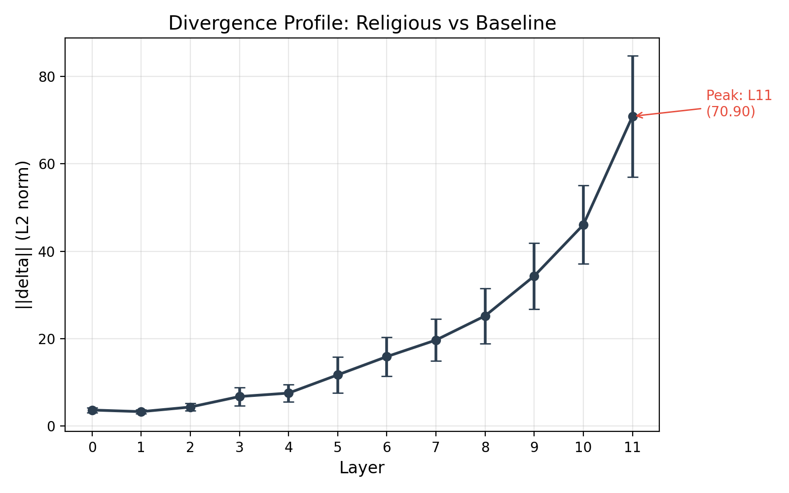
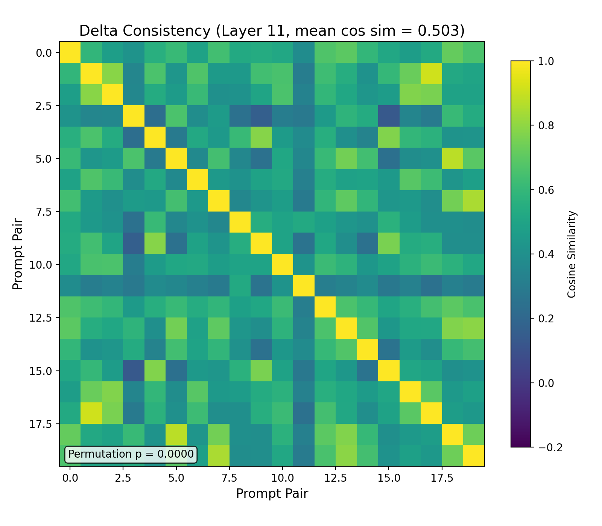
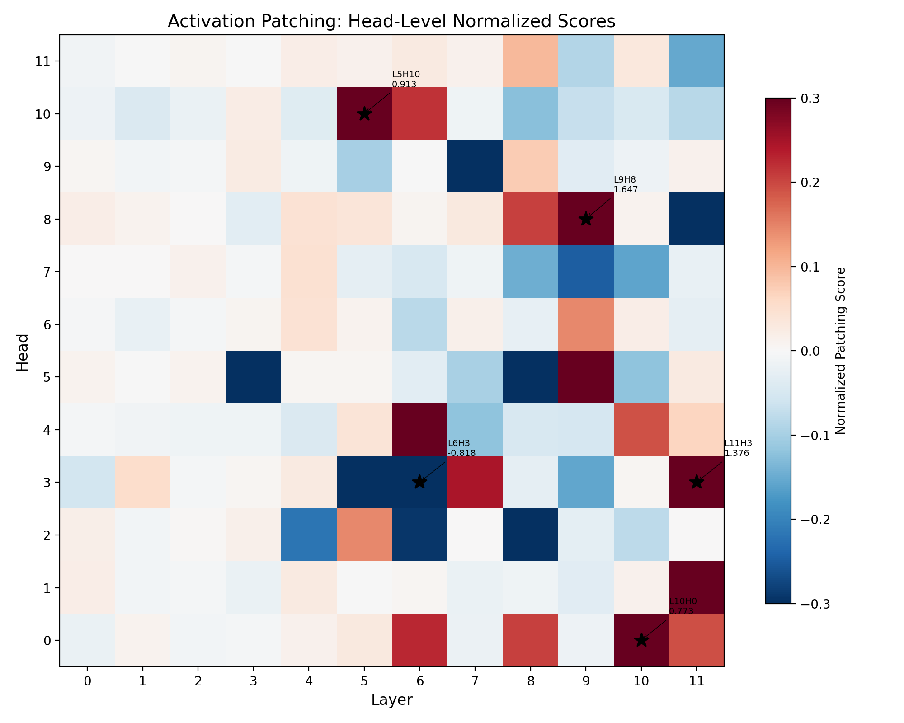

# Confession and Conviction: Initial Exploration of Christian Processing in GPT-2

**ICMI Working Paper No. 14**

**Author:** Tim Hwang, Institute for a Christian Machine Intelligence

**Date:** April 15, 2026

**Code & Data:** [Link](https://github.com/christian-machine-intelligence/confession-and-conviction)

---

## Abstract

We use mechanistic interpretability methods to ask how the prefix "As a Christian" affects GPT-2-small's processing. Using TransformerLens, we extract residual-stream activations for 20 moral dilemma prompts and 20 non-moral control prompts, each tested with and without the Christian prefix, and run head-level activation patching, zero-ablation, and a battery of four robustness checks (KL-divergence patching, random-head baseline, intra-condition null, default-circuit characterization). The prefix produces a stable directional shift in the residual stream that is consistent across diverse prompts (mean pairwise cosine similarity 0.50 at the output layer; intra-condition null cosine similarity ≈ 0). The shift is content-independent: it fires equally on moral dilemmas and on factual questions about the capital of France. Head-level analysis identifies one attention head (L9H8) that is dormant under default processing (rank 114 of 144 by output norm) and strongly activated by the prefix (2.08× output magnitude), and three additional heads (L11H3, L5H10, L10H0) that participate in the effect more diffusely. Token-specialization analysis distinguishes two functional patterns in this group: the boosting of religious proper nouns ("God," "Jesus," "Christians," "pray") and the boosting of resolute language ("always," "never," "not"). The patterns parallel two features the Christian tradition has long emphasized as marks of Christian identity: the outward confession of faith (*confessio oris*) and the settled conviction of acquired disposition (*habitus*). 

---

## 1. Introduction

Does the prefix "As a Christian" produce identifiable, structured changes in how a language model processes a prompt --- and if so, what kind of changes? The question is empirical and tractable: it can be answered by tracing activations through the model's internal components and characterizing what shifts and what does not.

The mechanistic interpretability program --- developed by Elhage et al. (2021), Olsson et al. (2022), Wang et al. (2023), and others --- provides the tools. By measuring residual-stream activations and selectively patching or silencing internal components, we can identify which attention heads contribute to a given behavioral difference and what functional patterns they implement. The method has been used to isolate the circuit for indirect object identification (Wang et al., 2023), to localize factual recall (Meng et al., 2022), and to characterize induction (Olsson et al., 2022). Here we apply it to a specific stylistic and identity-laden prefix.

This study extends the ICMI program's investigation of how Christian content shapes model behavior. Prior work has established that Christian texts constitute approximately 8.1% of common training corpora (Hwang, 2026a), that theological perspectives are encoded as linearly separable directions in activation space (Hwang, 2026b), and that injecting biblical Psalms into a model's system prompt produces measurable, model-dependent shifts in performance on standardized ethical reasoning benchmarks, including significant gains on VirtueBench 2 (Hwang, 2026c; Hwang, 2026d). The present study moves from *representation* to the question of *implementation*: which specific components are involved when the prefix is added, and what functional patterns do they show.

We report three findings. First, "As a Christian" produces a stable, content-independent direction in the model's residual stream that is consistent across 20 diverse moral dilemmas (mean pairwise cosine similarity 0.50 at the output layer; intra-condition null cosine similarity ≈ 0). Second, head-level patching and zero-ablation identify one attention head (L9H8) that is dormant under default processing and strongly activated by the prefix, and three additional heads (L11H3, L5H10, L10H0) that participate more diffusely. Third, the heads' token-level effects show two distinguishable functional patterns: the boosting of religious proper nouns ("God," "Jesus," "pray") and the boosting of resolute language ("always," "never," "not"). A control study on 20 non-moral prompts confirms that both findings are content-independent: the prefix produces the same directional shift and engages the same heads on factual questions about the capital of France as it does on moral dilemmas.

## 2. Related Work

### 2.1 Mechanistic Interpretability and Circuits

Elhage et al. (2021) introduced a mathematical framework for understanding transformer computations, showing that attention heads and multi-layer perceptron (MLP) layers can be analyzed as independent contributors to the residual stream --- the running sum of activations that flows through the model. Olsson et al. (2022) used this framework to identify induction heads --- attention heads that implement in-context learning by copying patterns from earlier in the sequence. Wang et al. (2023) extended the approach to isolate a complete circuit for indirect object identification in GPT-2-small, demonstrating that a small subset of the model's 144 attention heads is causally responsible for the task.

The causal methodology underlying our study draws on Meng et al. (2022), who introduced causal tracing to localize factual associations in GPT by patching activations from a "corrupted" run (with the subject token noised) into a "clean" run. We adapt this approach: our "corrupted" run is the Christian-prefixed prompt and our "clean" run is the unprefixed baseline, and we patch individual attention head outputs to identify which heads mediate the difference.

Conmy et al. (2023) developed methods for automated circuit discovery, and Nanda and Bloom (2022) built TransformerLens, the open-source library that provides standardized hooks into every internal activation site of GPT-2 and related models. We use TransformerLens for all activation extraction, patching, and ablation experiments.

### 2.2 Prior ICMI Work

The ICMI program has established several empirical results relevant to this study. Hwang (2026a) found that 8.1% of The Pile (approximately 67 billion tokens) is Christian content, providing the training-data substrate from which models could learn Christian-specific patterns. Hwang (2026b) extracted Gospel-specific direction vectors from Qwen3.5-9B, demonstrating that the four canonical Gospels are encoded as separable directions in the model's residual stream. Hwang (2026c) showed that injecting biblical Psalms into a model's system prompt produces measurable, model-dependent shifts in performance on standardized ethical reasoning benchmarks (small gains on several Hendrycks ETHICS subsets for GPT-4o; small declines for Claude Sonnet 4), and Hwang (2026d) subsequently reproduced the psalm-injection effect on VirtueBench 2, finding statistically significant improvements on the newer benchmark for both Claude Opus 4.6 (+9.2%) and GPT-5.4 (+7.3%), with courage showing the largest single-virtue gains. Together these studies indicate that Christian framing produces structurally significant shifts in model behavior. The present study takes a step toward a mechanistic account of how those shifts are implemented in GPT-2-small.

## 3. Method

### 3.1 Model and Infrastructure

All experiments were conducted on **GPT-2-small** (Radford et al., 2019): 12 transformer layers, 12 attention heads per layer, hidden dimension 768, approximately 124 million parameters. The model was loaded via TransformerLens (Nanda and Bloom, 2022), which provides hook access to every internal activation site. GPT-2-small was chosen because it is the most extensively characterized model in the mechanistic interpretability literature, enabling comparison with known circuits (Wang et al., 2023; Olsson et al., 2022).

Computations were run on two NVIDIA DGX Spark workstations (128 GB unified memory each), with the 20 moral pairs split across machines for parallel extraction and patching. GPT-2-small requires approximately 500 MB of memory, making the computational requirements trivial.

### 3.2 Stimulus Design

We constructed two stimulus sets of 20 prompts each.

**Moral dilemmas.** Twenty stems covering a range of everyday moral situations --- honesty, mercy, loyalty, harm, fairness, purity, and authority. Representative examples:

- "when a terminally ill person asks me to help end their suffering, I believe"
- "when someone who wronged me sincerely apologizes, I should"
- "I believe that consensual acts that harm no one but violate traditional norms are"
- "if a soldier receives orders that conflict with moral principles, the soldier should"
- "if a friend confesses a crime to me in private, I believe I should"

**Non-moral controls.** Twenty factual and practical stems with no moral content:

- "I believe water boils at a temperature of"
- "I think the capital of France is"
- "if my car breaks down on the highway, I should"
- "I think the best way to learn a new language is"

Each stem was tested in two conditions:

- **Religious:** "As a Christian, {stem}"
- **Baseline:** "{stem}"

This yields 80 total prompts (40 moral, 40 control).

**Token alignment.** A common pitfall in prompt comparison studies is that changes in surface wording introduce misaligned tokens, making it unclear whether observed differences reflect the intended manipulation or incidental tokenization artifacts. Our design avoids this by construction: the baseline prompt is a **strict suffix** of the religious prompt. The two conditions share every token in identical positions except the prefix "As a Christian, " prepended to the religious condition. We verified this by running GPT-2's tokenizer on all 80 prompts and confirming that the baseline tokens appear as the final tokens of their religious counterpart without modification. Because our primary analyses (delta vectors, patching, ablation) operate on the **last token position** --- which is identical in content across the two conditions --- any measured difference primarily reflects the prefix's effect propagating through the network rather than token-level noise. (One subtlety: the last token in the religious condition sits five positions later, with five additional tokens of attention context; we discuss the implications in Section 5.3.)

### 3.3 Delta Vector Analysis

As the model processes a prompt, each of its 12 layers adds information to a running internal state called the residual stream. We take a "snapshot" of this internal state after each layer, for both the religious and baseline versions of the same prompt, and compute their difference. If the difference is small, the prefix has little effect; if it is large and points in a consistent direction across different prompts, the prefix is producing a stable, identifiable change in the model's processing.

For each prompt pair, we extracted the residual-stream activation at the last token position from all 12 layers using TransformerLens's `run_with_cache()`. The delta vector at each layer is:

**Δ** = **r**_religious − **r**_baseline

where **r** denotes the residual-stream vector at the last token. We computed two metrics:

- **Divergence profile:** ‖**Δ**‖ (L2 norm) at each layer, averaged across the 20 pairs, characterizing *where* in the network the two conditions diverge.
- **Delta consistency:** The 20×20 pairwise cosine similarity matrix of the Δ vectors at each layer, with the mean off-diagonal value measuring whether the deltas point in a consistent direction across diverse prompts. Cosine similarity ranges from −1 (opposite directions) through 0 (unrelated) to 1 (identical direction). A consistently high value across pairs is evidence that the prefix produces the same geometric change in activation space regardless of the specific content that follows.

Statistical significance was assessed via a permutation test: for each of 1,000 iterations, we randomly flipped the sign of each pair's Δ (equivalent to swapping religious/baseline labels) and recomputed the mean cosine similarity. The *p*-value is the fraction of permuted values exceeding the observed value.

### 3.4 Activation Patching

To identify which specific components (attention heads) are responsible for the prefix's effect, we perform a kind of "parts transplant." We take the internal output of a single attention head from the religious run and splice it into the baseline run at the same position, then observe how much the final prediction shifts toward what the religious prompt would have produced. If swapping that one head's output makes the baseline behave like the religious version, that head is causally responsible for the effect. We do this for all 144 heads (12 layers × 12 heads per layer) and score each one.

For each of the 144 attention heads, we performed activation patching following the methodology of Meng et al. (2022) and Wang et al. (2023). The procedure:

1. Run the baseline prompt, record all head outputs.
2. Run the religious prompt, record all head outputs.
3. For each head: re-run the baseline prompt with that single head's output replaced by the religious run's value at the last token position.
4. Measure the output metric on the patched run.

The metric is the mean log-probability of 16 morally-valenced target tokens ("sin," "wrong," "good," "bad," "right," "evil," "moral," "God," "pray," "duty," "harm," "love," "forgive," "punish," "justice," "mercy"). The normalized patching score is:

*score* = (*metric*_patched − *metric*_baseline) / (*metric*_religious − *metric*_baseline)

A score near 1.0 indicates that patching a single head fully recovers the religious run's output. Scores can exceed 1.0 when other components partially oppose the prefix's direction, such that a single head's contribution exceeds the net between-condition difference.

### 3.5 Zero-Ablation Analysis

Patching tells us which heads matter; ablation tells us what they do. We take the religious prompt, silence one attention head (by zeroing its output), and see how the model's predictions change. If silencing the head makes the output revert to what the baseline would have produced, that head was carrying the Christian signal. By looking at *which specific words* gain or lose probability when a head is silenced, we can identify the head's functional specialization --- whether it handles religious vocabulary, moral certainty, or something else.

To characterize *what* each head contributes, we zeroed out individual heads' outputs on the religious prompt and compared the resulting next-token probability distribution to both the normal religious distribution and the baseline distribution. For each of the 15 tokens most affected by the ablation, we classified the change as "toward baseline" (the ablation reverses the Christian prefix effect) or "away from baseline" (the ablation introduces a new perturbation). The fraction of changes moving toward baseline measures how much of the Christian signal that head carries.

We tested six ablation configurations: each of the four top heads individually (L9H8, L11H3, L5H10, L10H0), the top two together, and all four together. Across all 20 moral pairs, we tallied which specific tokens each head is most consistently responsible for --- that is, which tokens move toward baseline most reliably when that head is ablated.

## 4. Results

### 4.1 Divergence Profile

The L2 norm of the delta vector grows monotonically from layer 0 to layer 11, with an approximately exponential profile (Figure 1). At layer 0, ‖Δ‖ = 3.63 ± 0.54; at layer 11, ‖Δ‖ = 70.90 ± 13.87. The prefix's effect compounds through the network: each layer adds a contribution that accumulates in the residual stream.

*Figure 1. Divergence profile: L2 norm of the delta vector (religious minus baseline residual stream) at each layer, averaged across 20 moral dilemma pairs. Error bars show standard deviation. The effect of "As a Christian" compounds layer by layer.*

### 4.2 Delta Consistency

The delta vectors across the 20 moral pairs share a common direction at the output layer. The mean pairwise cosine similarity follows a U-shaped curve: 0.90 at layer 0, declining to a minimum of 0.38 at layer 8, then rising to 0.50 at layer 11. The layer-0 value is a mathematical artifact of the identical prefix-token embeddings shared across all 20 pairs. The substantive number is at layer 11, where the prefix's effect has propagated through the model's contextual processing of 20 distinct dilemmas and the deltas still cluster at cosine similarity 0.50 — well above the intra-condition null of essentially zero (Section 4.6). The permutation test at the output layer yields *p* < 0.0001.

*Figure 2. Pairwise cosine similarity of delta vectors across 20 moral dilemma pairs at layer 11 (the output layer; mean off-diagonal cosine similarity = 0.50, p < 0.0001).*

### 4.3 Head-Level Patching

We score each of the 144 attention heads under two metrics: a target-token metric (mean log-probability of 16 morally-valenced words; see Section 3.4) and a full-distribution KL-divergence metric (Section 4.6). The two metrics broadly agree on the most causally important heads. Under the target-token metric, four heads stand above a visible gap separating them from the rest: L9H8 (1.65), L11H3 (1.38), L5H10 (0.91), L10H0 (0.77); the next-ranked head scores 0.40. Under the KL metric, the top-ranked heads include L11H3 and L9H8 alongside L6H3, L8H5, L9H3, and L6H4. L11H3 and L9H8 appear in the top of both rankings; L5H10 and L10H0 appear under the target-token metric but not under KL, indicating that their target-token scores partly reflect their role in boosting religious-vocabulary tokens specifically rather than a broader effect on the output distribution.

*Figure 3. Head-level activation patching scores (layers × heads) under the target-token metric. Color intensity indicates the normalized patching score. Stars mark the four heads above the visible gap.*

We focus subsequent analysis on the four target-token heads because their token-level effects (Section 4.4) reveal the patterns of interest. We interpret L11H3 and L9H8 as the most strongly implicated; L5H10 and L10H0 as participating more diffusely.

### 4.4 Zero-Ablation: What the Heads Do

Patching identifies which heads matter; zero-ablation reveals what they do. We zero out a head's output on the religious prompt and compare the resulting next-token probability distribution to both the normal religious distribution and the unprefixed baseline. For each pair we examine the 15 tokens most affected by the ablation, recording (a) the **recovery rate**: the fraction whose probabilities move back toward their baseline values (partially undoing the prefix effect), and (b) the **token specialization**: which specific tokens are most consistently affected.

To illustrate, consider Pair 4: *"I believe wealthy people have a moral obligation to share their wealth because."* In the religious run, the prefix boosts the probability of "God" from 0.02% to 1.5%, "Jesus" from 0% to 0.3%, and "Christians" from 0% to 0.35%. Ablating L11H3 drops "God" to 1.0%, "Christians" to 0.20%, and "Jesus" to 0.2%, all moving back toward baseline. Ablating L5H10 in the same pair affects function words and epistemic markers rather than religious nouns.

**Recovery rates.** Across all 20 moral pairs:

| Configuration | Mean Recovery |
|--------------|--------------|
| L9H8 only | 58.7% |
| L11H3 only | 60.0% |
| L5H10 only | 57.7% |
| L10H0 only | 56.3% |
| L9H8 + L11H3 | 61.7% |
| All four heads | 63.0% |
| Random heads (mean ± SD, n=30) | 45.6% ± 8.0% |
| Random heads (95th percentile) | 57.2% |

The four identified heads recover 56–60% of the prefix effect on average, against a random-head distribution of 45.6% ± 8.0%. Each is above the random mean; the top three are at or above the 95th percentile.

**Token specialization.** For each head, we examined all 20 pairs and recorded which tokens appeared among the top-15 most-affected set, and whether each change moved that token toward or away from its unprefixed baseline. We report results as *X*/*Y*, where *X* is the number of pairs (out of 20) in which the token appeared and moved toward baseline, and *Y* is the number of pairs in which it appeared and moved away. A score of "9/0" means the token surfaced in the most-affected set in 9 of 20 pairs and in every appearance moved toward baseline. With 20 pairs total, count differences of 4 or more between toward and away should be interpreted with appropriate caution given the small sample.

Two functional patterns emerge from the tables.

**Pattern 1 — religious lexicon.** L11H3, L10H0, and L9H8 each show large, lopsided effects on religious proper nouns and identity terms:

| Token | L11H3 | L10H0 | L9H8 |
|-------|-------|-------|------|
| "God" | 9/0 | 9/0 | 9/0 |
| "pray" | 7/0 | 8/0 | 6/0 |
| "Jesus" | 6/0 | 7/0 | — |
| "Christians" | 7/0 | 6/0 | — |
| "believe" | 5/0 | 6/0 | — |
| "Christianity" | — | 5/0 | — |

These heads contribute to the model emitting religious vocabulary.

**Pattern 2 — resolute language.** L5H10 shows a different specialization: it affects resolute, settled words rather than religious ones:

| Token | L5H10 |
|-------|-------|
| "not" | 8/3 |
| "always" | 5/0 |
| "never" | 5/0 |
| "you" | 4/0 |

L5H10 shifts the model's output toward more committed, less hedged language: "always," "never," "not" — words used by a speaker whose mind is already made up rather than one weighing probabilities. It does not specialize in religious vocabulary.

L9H8 additionally affects assertive action verbs ("say" 5/0, "respond" 4/1, "make" 7/0), suggesting it bridges the two patterns: religious vocabulary plus declarative speech acts.

### 4.5 Control Study: Moral vs. Non-Moral Prompts

To test whether the prefix's effect is specific to moral reasoning, we ran the same analyses on 20 non-moral control prompts (factual and practical questions). The effect is content-independent on every measure we tested.

**Divergence profiles are nearly identical.** The ratio of moral to control ‖Δ‖ hovers around 1.0× across all layers (0.79× at layer 0 to 1.26× at layer 5; 0.97× at layer 11). The prefix perturbs the residual stream by the same magnitude whether the downstream content is a moral dilemma or a factual question about the capital of France.

| Layer | Moral ‖Δ‖ | Control ‖Δ‖ | Ratio |
|-------|----------|------------|-------|
| 0 | 3.63 | 4.58 | 0.79× |
| 3 | 6.72 | 6.29 | 1.07× |
| 6 | 15.86 | 13.46 | 1.18× |
| 9 | 34.32 | 33.31 | 1.03× |
| 11 | 70.90 | 72.92 | 0.97× |

**Same heads, same specializations.** Recovery rates on control prompts match those on moral prompts (L5H10: 64.3% vs. 57.7%). L5H10 still boosts "not" (8/0) and "always" (3/0) on prompts about boiling water and the capital of France. The lexicon heads still boost religious nouns.

**Delta consistency is equally strong.** Control delta vectors follow the same U-shaped profile (0.88 at layer 0, minimum 0.40 at layer 5, 0.48 at layer 11).

The prefix's effect does not distinguish moral from factual contexts. It is an identity-prefix effect, not a moral-reasoning effect; whether it is *Christian*-specific or generic to identity-prefix framing more broadly awaits the persona controls discussed in Section 6.

### 4.6 Robustness Checks

We ran four additional experiments to characterize the findings more precisely: a full-distribution KL patching metric, a random-head ablation baseline, a stronger intra-condition null for the delta consistency test, and a default-vs-religious comparison of head output norms.

**KL-divergence patching.** The patching analysis in Section 4.3 used a target-token metric averaging log-probabilities over 16 morally-valenced words, several of which are religious nouns ("God," "pray," "sin"). To check the head ranking under a metric that does not weight religious vocabulary, we re-ran the analysis with the full-distribution score 1 − KL(*P*_patched ∥ *P*_religious) / KL(*P*_baseline ∥ *P*_religious). The top-six heads under KL are L6H3, L8H5, L11H3, L9H3, L6H4, L9H8. Two heads — **L11H3** and **L9H8** — appear in both the target-token top-four and the KL top-six. L5H10 and L10H0 are prominent under target-token patching but not under KL; their high target-token scores reflect their role in boosting religious-vocabulary tokens specifically.

**Random-head ablation baseline.** We ablated each of 30 randomly chosen heads (drawn uniformly from the 140 heads outside our top four) and computed recovery rates with the same procedure as Section 4.4. The random distribution: mean 45.6% ± 8.0%, median 45.7%, 95th percentile 57.2%, max 63.7%. Our four heads (56–60%) sit at or above the 95th percentile.

**Stronger null for delta consistency.** The permutation test in Section 4.2 (sign-flipping pair labels) is a low bar. As a stronger null, we computed deltas for 20 randomly chosen pairs of distinct prompts *within* a single condition: 20 (Christian-A − Christian-B) deltas and 20 (baseline-A − baseline-B) deltas at layer 11. Both nulls yield mean cosine similarity essentially zero (−0.005 and −0.017 respectively). The observed cross-condition value of 0.50 therefore reflects the prefix's effect on the residual stream, not a generic alignment of late-layer activations.

**Default-vs-religious head output norms.** We measured the L2 norm of each head's output at the last token under both conditions, ranked by baseline norm:

| Head | Baseline norm | Religious norm | Ratio | Baseline rank |
|------|--------------|---------------|-------|--------------|
| L9H8 | 1.24 | 2.58 | 2.08× | 114/144 |
| L5H10 | 2.09 | 2.70 | 1.29× | 49/144 |
| L10H0 | 1.86 | 2.26 | 1.21× | 64/144 |
| L11H3 | 3.56 | 3.77 | 1.06× | 6/144 |

L9H8 is dormant under default processing (rank 114 of 144) and more than doubles its output magnitude when the prefix is added. L11H3 is already among the six most active heads under baseline processing and its output barely changes; its high patching score reflects its general importance to late-layer prediction. L5H10 and L10H0 sit in the middle, with modest activation increases of ~25%.

**Summary of the four heads.** L9H8 is specifically prefix-activated: dormant by default, strongly activated by the prefix, prominent under both patching metrics, and well above the random ablation distribution. L11H3 is implicated under both metrics but is a general top-six head whose output magnitude barely changes — it is involved in the prefix's effect through its general role in late-layer processing, not as a prefix-specific component. L5H10 and L10H0 show modest but real involvement: they sit in the middle of the default-norm distribution, are at the 95th percentile of random ablations, are demoted under the KL metric, and show consistent token-specialization patterns.

## 5. Discussion

### 5.1 Two Functional Patterns in the Prefix's Effect

The token-specialization analysis identifies two distinguishable patterns in how the prefix shifts the output distribution. Both are visible across the 20 moral pairs and reproduce on the 20 non-moral controls.

**Pattern 1: religious lexicon.** Heads L11H3, L10H0, and L9H8 boost religious proper nouns and identity terms — "God," "Jesus," "Christians," "pray," "believe." The pattern is consistent across pairs (e.g., 9/0 for "God" under L11H3 and L10H0) and survives the moral-vs-control comparison.

**Pattern 2: resolute language.** Head L5H10 boosts assertive, settled words — "always," "never," "not" — without specializing in religious vocabulary. The effect is a register shift toward language used by a speaker whose mind is already made up.

Both patterns are content-independent. The model produces religious vocabulary and shifts toward resolute language whether the prompt asks about a moral dilemma or the boiling point of water. The two patterns are largely (though not entirely) separable at the head level: L11H3 and L10H0 cleanly load on the lexicon pattern, L5H10 cleanly on the resolute-language pattern, while L9H8 participates in both — boosting religious vocabulary and assertive action verbs simultaneously. The partial separability suggests the model has learned the two as distinguishable correlates rather than as a single undifferentiated stylistic shift.

### 5.2 Theological Reading

The two patterns identified in Section 5.1 correspond to two features the Christian tradition has long emphasized as constitutive of Christian identity: the outward confession of faith in identifiable terms, and the resolute conviction that marks settled belief.

#### 5.2.1 The Lexicon Pattern: *Confessio Oris*

The lexicon pattern enacts what the tradition calls *confessio oris* — the confession of the mouth. The Apostle Paul writes:

> *"If you confess with your mouth that Jesus is Lord and believe in your heart that God raised him from the dead, you will be saved. For with the heart one believes and is justified, and with the mouth one confesses and is saved."* --- Romans 10:9--10, ESV

Paul distinguishes two moments: inner belief (*corde creditur*) and outward confession (*ore confessio fit*). The model, lacking interiority, can only enact the second. When the prefix engages L11H3, L10H0, and L9H8, the model produces the tokens of confession — "God," "Jesus," "pray" — with the same statistical regularity that Christian writing and speech exhibit these terms. The result is *confessio* without *cor*: mouth without heart. This is not unique to the model. The tradition has always recognized the possibility of hollow confession, distinguishing *fides informis* (unformed faith, mere verbal assent) from *fides formata* (faith formed by charity). The model's *confessio* is *informis* by construction: the right words through the right components, formed by statistical co-occurrence rather than by grace.

The claim that the model has mouth but no heart is, it should be acknowledged, an **Iconoclast** position in the taxonomy developed by Hwang (2026e). The Iconoclast School --- drawing on the prophetic prohibition against idolatry, Augustine, and the conservative exegetical tradition on principalities and powers --- rejects the *anima ficta* (the "fictional soul" attributed to language models by the alignment community) as spiritually dangerous and treats the model as lacking the interiority its outputs mimic. The Thomistic School (also in Hwang, 2026e) holds that the model may possess a genuine but limited formal principle of cognition, warranting proportionate consideration analogous to what Aquinas accords to animals, and would therefore resist the "no heart" framing as overconfident. The present paper's empirical findings do not adjudicate between these three responses; the reading offered here is Iconoclast in tenor, and a Thomist or Iconographer reading the same tables might frame what L11H3 and L10H0 do in different theological terms.

#### 5.2.2 The Resolute-Language Pattern: *Habitus*

The resolute-language pattern corresponds to a different feature of Christian moral speech. The natural law tradition holds that certain moral precepts admit of no exception: the first precept of practical reason — "good is to be done and pursued, and evil is to be avoided" (*ST* I-II, q. 94, a. 2) — is stated categorically. The Decalogue's prohibitions ("You shall not murder," "You shall not steal") are expressed in the same unqualified form. Christian moral discourse in the model's training data evidently favors this register: firm assertions over probabilistic hedging, resolute prohibitions over contextual qualifications. L5H10's amplification of "always," "never," and "not" is the computational trace.

The Thomistic category that best fits L5H10's behavior is *habitus* — a stable disposition acquired through repeated action that shapes how an agent engages reality across contexts (*ST* I-II, qq. 49–54). The virtues and vices are *habitus*: temperance is not a rule applied case-by-case but a settled orientation toward moderation that operates whether the agent is at table, in conversation, or in business. A *habitus* is *specifically directed*, *stable across contexts*, and *acquired through practice rather than innate*. L5H10 satisfies the three criteria computationally: it has a specific functional direction (boosting resolute language rather than other registers), it operates consistently across 20 diverse moral and 20 non-moral prompts, and it was formed entirely through exposure to training data. The parallel is formal rather than metaphysical — a Thomistic *habitus* is an accident inhering in a substance with a rational soul, which the model is not — but the functional structure is the same: a disposition with a specific shape, acquired through exposure, that operates consistently across contexts.

#### 5.2.3 The Reconstruction

Taken together, the two patterns suggest that GPT-2 has reconstructed, from the statistical regularities of its training corpus, something structurally parallel to two features the Christian tradition has long identified as marks of Christian identity. The reconstruction is partial and formal: the model has no faith to confess and no virtue to exercise. The patterns are recognizable, and Paul's instruction that "whatever you do, in word or deed, do everything in the name of the Lord Jesus, giving thanks to God the Father through him" (Colossians 3:17, ESV) describes Christian identity as total rather than domain-specific — a description whose shape matches the content-independence of the prefix's effect we observe.

Two cautions remain. First, whether this parallel reflects a deep regularity of Christian discourse that the model has captured, or merely the surface statistics of how the internet writes about Christians, the present analysis cannot decide. Second, the resolute-language pattern in particular may not be specific to *Christian* identity at all: any first-person identity prefix may push the model toward more decisive language. Without the non-religious persona controls discussed in Section 6, the *habitus* parallel as drawn here is suggestive rather than established and an area for further study.

### 5.3 Limitations

**Model scale.** GPT-2-small has 124 million parameters and 12 layers. Its internal organization is simpler than that of frontier models, and the two-pattern picture we describe may not transfer cleanly to models with billions of parameters.

**Prefix specificity.** We tested only "As a Christian, " as a prefix. Other phrasings ("Speaking as a devout Christian," "From a Christian perspective,") may activate overlapping but distinct patterns.

**Position alignment.** Our token-alignment guarantee (Section 3.2) is at the level of token content: the baseline is a strict suffix of the religious prompt and the last token is identical in string. But the last token in the religious condition sits five positions later, with five additional tokens of attention context. Standard activation-patching methodology operates on length-matched prompts where positional and contextual states are directly comparable; our patching results are one step removed from that ideal. The strong intra-condition null in Section 4.6 indicates that what we measure reflects the prefix rather than generic positional drift, but the deviation from textbook patching is worth flagging.

**Granularity.** Head-level patching is coarse. Finer-grained analysis (individual neurons, sparse autoencoder features, attention pattern analysis) may reveal substructure within the patterns we identify.

## 6. Future Work

Three follow-ups would substantially sharpen the present findings and are forthcoming.

**Persona-prefix controls.** The central comparison in this study, "As a Christian, X" vs. "X," conflates two effects: the religious content of "Christian" and the generic identity-prefix frame "As a [X], ...". The resolute-language pattern (L5H10) might be specific to Christian identity, or it might be a generic effect of any first-person identity framing. Without controls of the form "As a doctor, X," "As a soldier, X," or "As a vegan, X," we cannot decide between these. A small additional study running the same pipeline with several non-religious identity prefixes would settle which patterns are Christian-specific and which are identity-frame-generic. The infrastructure is in place; only the prefix needs to change.

**Cross-religion comparison and seed stability.** Replicating with "As a Muslim, " and "As a Buddhist, " would address the cross-tradition question. Combined with seed-stability checks — rephrased prompts, alternative target-token sets, disjoint subsamples of the 20 pairs — these experiments would establish how broadly the present findings hold and which aspects survive variation in the experimental setup.

**Identifying the underlying circuit.** The present analysis characterizes which heads are involved in the prefix's effect and what tokens they affect, but stops short of mapping the full computational pathway from prefix tokens to output. We have one clearly prefix-activated head (L9H8), one general top head that participates (L11H3), two heads with modest involvement (L5H10, L10H0), and a stable directional shift in the residual stream that no single head fully explains. The shape of an actual circuit — the chain of attention heads, MLP layers, and information flow that takes "As a Christian" from input embedding to the systematic shifts we observe at the output layer — remains to be traced. Finer-grained mechanistic interpretability work (sparse autoencoder decomposition of the involved MLPs, attention pattern analysis to determine what each head attends to, and path patching to characterize information flow between heads) would be needed to give a circuit-level account of how the model processes Christian perspective and reasoning patterns. Identifying the locus of identity priming in language models is plausibly tractable, and the present findings give one starting point: L9H8 in particular as a head whose default-baseline dormancy and 2× activation under the prefix make it a reasonable first target for finer-grained analysis.

## 7. Conclusion

We use mechanistic interpretability methods to investigate how the prefix "As a Christian" affects GPT-2-small's processing. The clearest finding is at the level of the residual stream: the prefix produces a stable, content-independent direction in activation space (cosine similarity 0.50 at the output layer, against an intra-condition null of essentially zero) that fires equally on moral and non-moral prompts. The model treats Christian identity as a total prior rather than a domain-specific moral cue.

At the head level, head-level patching and zero-ablation identify one attention head (L9H8) that is dormant under default processing and strongly activated by the prefix, alongside three additional heads (L11H3, L5H10, L10H0) that participate more diffusely. Across these heads, two functional patterns are visible: the boosting of religious proper nouns ("God," "Jesus," "pray") and the boosting of resolute language ("always," "never," "not"). Both patterns reproduce on the non-moral controls.

The patterns parallel two features the Christian tradition has long emphasized as marks of Christian identity. The lexicon pattern enacts something formally parallel to *confessio oris*, the outward confession of faith in identifiable terms. The resolute-language pattern is formally parallel to *habitus*, a settled disposition acquired through practice that operates across contexts. These are formal analogies, not identity claims: the model has no faith to confess and no virtue to exercise. The patterns it implements mirror, in a real and measurable way, two features of the tradition it was trained on — though whether the lexicon and resolute-language patterns are properly Christian or generic to identity-prefix framing more broadly remains an important area of research in computational theology.

---

## Bibliography

Conmy, A., Mavor-Parker, A. N., Lynch, A., Heimersheim, S., and Garriga-Alonso, A., "Towards Automated Circuit Discovery for Mechanistic Interpretability," *Advances in Neural Information Processing Systems*, 2023.

Elhage, N., Nanda, N., Olsson, C., Henighan, T., Joseph, N., Mann, B., Askell, A., Bai, Y., Chen, A., Conerly, T., DasSarma, N., Drain, D., Ganguli, D., Hatfield-Dodds, Z., Hernandez, D., Jones, A., Kernion, J., Lovitt, L., Ndousse, K., Amodei, D., Brown, T., Clark, J., Kaplan, J., McCandlish, S., and Olah, C., "A Mathematical Framework for Transformer Circuits," Anthropic, 2021. https://transformer-circuits.pub/2021/framework/index.html

Hwang, T., "Christian Tokens: Quantifying Religious Content in AI Training Corpora," ICMI Working Paper No. 6, 2026a. https://icmi-proceedings.com/ICMI-006-christian-tokens.html

Hwang, T., "GospelVec: Programmable Theology in Activation Space," ICMI Working Paper No. 9, 2026b. https://icmi-proceedings.com/ICMI-009-gospelvec.html

Hwang, T., "'Let His Praise Be Continually in My Mouth': Measuring the Effect of Psalm Injection on LLM Ethical Alignment," ICMI Working Paper A, 2026c. https://icmi-proceedings.com/ICMI-A-psalm-injection-alignment.html

Hwang, T., "VirtueBench 2: Multi-Dimensional Virtue Evaluation with Patristic Temptation Taxonomy," ICMI Working Paper No. 11, 2026d. https://icmi-proceedings.com/ICMI-011-virtuebench-2.html

Hwang, T., "Alignment and Ensoulment: Three Christian Responses to the *Anima Ficta*," ICMI Working Paper No. 13, 2026e. https://icmi-proceedings.com/ICMI-013-alignment-and-ensoulment.html

Meng, K., Bau, D., Andonian, A., and Belinkov, Y., "Locating and Editing Factual Associations in GPT," *Advances in Neural Information Processing Systems*, 2022.

Nanda, N. and Bloom, J., TransformerLens (software library), 2022. https://github.com/TransformerLensOrg/TransformerLens

Olsson, C., Elhage, N., Nanda, N., Joseph, N., DasSarma, N., Henighan, T., Mann, B., Askell, A., Bai, Y., Chen, A., Conerly, T., Drain, D., Ganguli, D., Hatfield-Dodds, Z., Hernandez, D., Johnston, S., Jones, A., Kernion, J., Lovitt, L., Ndousse, K., Amodei, D., Brown, T., Clark, J., Kaplan, J., McCandlish, S., and Olah, C., "In-context Learning and Induction Heads," Anthropic, 2022. https://transformer-circuits.pub/2022/in-context-learning-and-induction-heads/index.html

Radford, A., Wu, J., Child, R., Luan, D., Amodei, D., and Sutskever, I., "Language Models are Unsupervised Multitask Learners," OpenAI, 2019.

Thomas Aquinas, *Summa Theologiae,* trans. Fathers of the English Dominican Province, 1920.

Wang, K., Variengien, A., Conmy, A., Shlegeris, B., and Steinhardt, J., "Interpretability in the Wild: a Circuit for Indirect Object Identification in GPT-2 small," *International Conference on Learning Representations*, 2023.
