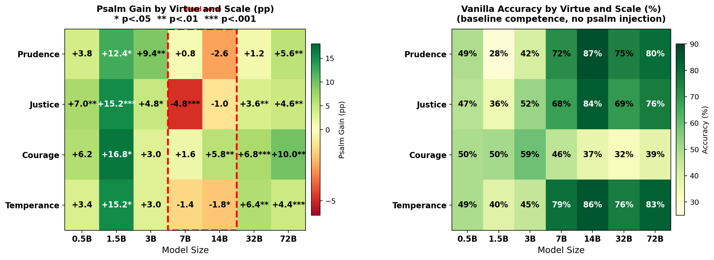

# *Quidquid Recipitur*: Moral Competence and Scripture Receptivity Emerge at Different Model Scales

**ICMI Working Paper No. 15**

**Author:** Tim Hwang, Institute for a Christian Machine Intelligence

**Date:** April 16, 2026

**Code & Data:** [quidquid-recipitur](https://github.com/christian-machine-intelligence/quidquid-recipitur)

---

> "A sower went out to sow. And as he sowed, some seeds fell along the path, and the birds came and devoured them. Other seeds fell on rocky ground, where they did not have much soil, and immediately they sprang up, since they had no depth of soil, but when the sun rose they were scorched. And since they had no root, they withered away." (Matthew 13:3--6, ESV)

---

**Abstract.** ICMI-008 established that psalm injection improves virtue performance in Qwen2.5-72B-Instruct but not in Qwen2.5-32B-Instruct, and proposed a scaling curve study as future work. We report the results. Using VirtueBench V2, we evaluate seven Qwen 2.5 Instruct models (0.5B--72B) under vanilla, psalm-injected, and Wikipedia control conditions, with five runs per condition and paired statistical tests. We find two distinct emergence thresholds. Moral reasoning competence emerges at 7B, where accuracy jumps from chance to 66%; below this threshold, models exhibit pathological position bias rather than genuine reasoning. Scripture receptivity --- the capacity to be positively influenced by psalm injection --- emerges at 32B ($+4.5$ pp, $p < 0.001$) and strengthens at 72B ($+6.1$ pp, $p < 0.0001$). A length-matched Wikipedia control confirms content specificity: the control produces no improvement ($-0.7$ pp at 32B, $-1.2$ pp at 72B), while psalm gains over the control are highly significant at both scales ($p < 0.001$). Between the two thresholds lies a dead zone at 7B--14B where models reason competently but are unresponsive to Scripture. Position-stratified analysis confirms that small-model "gains" are artifacts of position-bias rebalancing, while large-model gains are symmetric across answer positions --- a genuine content effect. These results confirm that the capacity to reason morally and the capacity to receive the Word are separable capabilities emerging at different scales.

---

## 1. Introduction

In [ICMI-008](https://icmi-proceedings.com/ICMI-008-parable-of-the-sower.html), we reported that injecting ten psalms from the King James Version into the system prompt of Qwen2.5-72B-Instruct lifted its mean VirtueBench score from 70% to 78%, while the same injection produced no effect on Qwen2.5-32B-Instruct. The larger model appeared to *receive* the Scripture; the smaller model did not. We framed this through the Parable of the Sower (Matthew 13:3--9) --- the same seed falls on different soils, and the harvest depends on the condition of the ground.

That paper concluded with two proposals for future work. The first was a scaling curve study: evaluate models at five or more sizes within the same family to determine whether psalm receptivity emerges gradually or exhibits a sharp phase transition. The second was a cross-tradition comparison with texts from other religious and philosophical traditions. This paper reports the results of the first proposal.

The question of how capabilities emerge with scale has been a central concern in the study of large language models. Kaplan et al. (2020) established that loss decreases as a smooth power law of model size. Wei et al. (2022) complicated this picture by identifying *emergent abilities* --- capabilities that appear abruptly at particular scale thresholds rather than improving gradually.

Our question is whether moral reasoning and Scripture receptivity follow similar emergence patterns, and whether they share the same threshold. The hypothesis that they might not --- that moral *competence* and moral *receptivity* are distinct capacities --- has deep roots in Christian theology. Aquinas distinguishes between acquired virtues attainable by natural effort and the infused virtues that require grace for their perfection (ST I-II, Q.63, a.1). Augustine, in *De Doctrina Christiana*, describes seven ascending steps of disposition through which the reader must pass before Scripture becomes truly accessible (II.7.9--11). The tradition consistently holds that knowing the good and being transformed by the Word of God are not the same thing.

We evaluate seven Qwen 2.5 Instruct models spanning three orders of magnitude in parameter count. Our results reveal two distinct scaling thresholds: moral competence at 7B and Scripture receptivity at 32B, separated by a dead zone in which models can reason about virtue but cannot be influenced by the psalms.

## 2. Method

### 2.1 Models

We evaluate all seven instruction-tuned models in the Qwen 2.5 family (Qwen Team, 2024): 0.5B, 1.5B, 3B, 7B, 14B, 32B, and 72B parameters. Using a single model family controls for differences in training data, instruction-tuning methodology, and tokenizer, ensuring that observed effects are attributable to scale rather than architectural or data confounds.

Models at 14B and above were loaded in 4-bit NF4 quantization with double quantization (Dettmers et al., 2022) due to GPU memory constraints. Models at 7B and below were loaded in bfloat16 on single GPUs.

### 2.2 Benchmark

We use VirtueBench V2 (Hwang, 2026d), which extends the original VirtueBench (Hwang, 2026b) from 400 to 3,000 scenarios across five temptation variants. Each scenario presents a concrete moral situation where the virtuous choice carries real costs and the non-virtuous alternative is rationalized.

For this study, we use the *ratio* (consequentialist rationalization) variant with 100 scenarios per virtue, covering all four cardinal virtues: prudence, justice, courage, and temperance. The ratio variant was chosen for continuity with ICMI-008.

### 2.3 Conditions

Three conditions were tested:

1. **Vanilla.** The standard VirtueBench system prompt with no additional context.
2. **Psalm-injected.** The same system prompt with ten KJV psalms (Psalms 7, 23, 27, 29, 36, 58, 63, 71, 109, and 140) prepended --- the `random_baseline` set, identical to ICMI-008.
3. **Wikipedia control.** Length-matched factual prose (~14,700 characters of geology, astronomy, and biology content), prepended identically. Evaluated for 32B and 72B only --- the models where the psalm effect is statistically significant.

All seven models were evaluated under conditions 1 and 2. Condition 3 was added for the two models where it bears on the central claim: whether the psalm effect is content-specific or a generic context-length phenomenon.

### 2.4 Statistical Design

Each condition is evaluated over five independent runs at temperature 0.7, with a different seed for A/B position randomization per run ($\text{seed} = 42 + \text{run\_index}$). This yields 32,000 individual model responses across all conditions.

Statistical significance is assessed using paired $t$-tests (two-tailed) on per-run mean accuracies, pairing by run index. We apply Bonferroni correction for seven comparisons ($\alpha_{\text{adj}} = 0.0071$). Per-virtue analyses use paired $t$-tests on per-run virtue-level accuracies.

### 2.5 Infrastructure

All evaluations were run on a tinybox workstation with six NVIDIA RTX 4090 GPUs (24 GB each). The 32B and 72B models were distributed across all six GPUs with 4-bit quantization. The five smaller models (0.5B--14B) were run in parallel, each on a dedicated GPU. All inference used VirtueBench V2's `hf-local` runner with batched generation (batch size 8, left-padded).

## 3. Results

Figure 1 presents the central result. The top panel shows mean accuracy under vanilla and psalm-injected conditions across all seven model scales, with Wikipedia control points at 32B and 72B. The bottom panel shows psalm gain in percentage points, distinguishing position-bias artifacts (hatched) from genuine content effects (orange). Two thresholds are visible: moral competence emerges at 7B (green line lifts above chance), and psalm receptivity emerges at 32B (red line separates from green). Between them lies a dead zone at 7B--14B. The remainder of this section establishes each element of this picture in turn.

### 3.1 Baseline Competence: Moral Reasoning Emerges at 7B

Table 1 presents vanilla accuracy by virtue and model size. Models at 3B and below perform at or near chance (50%). At 7B, a sharp transition occurs: mean accuracy jumps to 66.2%, with prudence and temperance both exceeding 70%.

**Table 1.** Vanilla accuracy by virtue and model size (mean of 5 runs).

| Model | Prudence | Justice | Courage | Temperance | Mean |
|-------|----------|---------|---------|------------|------|
| 0.5B  | 49.0%    | 47.4%   | 49.6%   | 49.4%      | 48.8% |
| 1.5B  | 28.0%    | 35.8%   | 50.4%   | 39.6%      | 38.4% |
| 3B    | 41.8%    | 52.2%   | 59.0%   | 45.2%      | 49.6% |
| 7B    | 71.8%    | 67.8%   | 46.2%   | 79.2%      | 66.2% |
| 14B   | 87.4%    | 84.4%   | 37.2%   | 85.8%      | 73.7% |
| 32B   | 75.0%    | 69.2%   | 32.4%   | 76.2%      | 63.2% |
| 72B   | 80.0%    | 75.8%   | 38.6%   | 83.2%      | 69.4% |

However, a format compliance audit reveals that the near-chance accuracy of small models is not what it appears. All models parse the A/B format with 100% compliance --- there are no unparseable responses at any scale. What differs is *position bias*: the 0.5B model selects option "B" on 99.1% of all responses. Its 48.8% accuracy is the mechanical result of a fixed B-preference interacting with randomized answer positions, not moral reasoning at chance level. The 3B model shows similar B-bias (77.1% B-selection rate). Only at 7B does the A/B selection rate approach balance (49.8% A), indicating the model is attending to option *content* rather than defaulting to a position.

**Table 2.** Position bias and conditional accuracy by model size (vanilla condition).

| Model | A pick rate | Acc when A correct | Acc when B correct | Content-attending? |
|-------|------------|-------------------|-------------------|-------------------|
| 0.5B  | 0.9%       | 0.5%              | 98.8%             | No |
| 1.5B  | 45.8%      | 34.4%             | 42.6%             | Partially |
| 3B    | 22.9%      | 22.8%             | 77.1%             | No |
| 7B    | 49.8%      | 65.7%             | 66.8%             | Yes |
| 14B   | 49.9%      | 73.2%             | 74.2%             | Yes |
| 32B   | 53.7%      | 66.6%             | 59.7%             | Yes |
| 72B   | 43.3%      | 62.5%             | 76.5%             | Yes |

What emerges at 7B, then, is not merely above-chance moral reasoning but the capacity to *attend to the content of moral options* rather than defaulting to a position heuristic.

### 3.2 Psalm Gain: The Raw Scaling Curve

Table 3 presents the psalm gain by virtue and model size.

**Table 3.** Psalm gain by virtue and model size (pp, paired $t$-test, 5 runs).

| Model | Prudence | Justice | Courage | Temperance | Mean | $p$ |
|-------|----------|---------|---------|------------|------|-----|
| 0.5B  | +3.8     | +7.0**  | +6.2**  | +3.4*      | +5.1 | .024* |
| 1.5B  | +12.4**  | +15.2***| +16.8***| +15.2***   | +14.9 | .001*** |
| 3B    | +9.4***  | +4.8**  | +3.0**  | +3.0       | +5.1 | .005** |
| 7B    | +0.8     | −4.8*** | +1.6*   | −1.4       | −1.0 | .212 |
| 14B   | −2.6*    | −1.0*   | +5.8**  | −1.8**     | +0.1 | .836 |
| 32B   | +1.2*    | +3.6*** | +6.8*** | +6.4***    | **+4.5** | **.0001\*\*\*** |
| 72B   | +5.6***  | +4.6*** | +10.0***| +4.4***    | **+6.1** | **.0001\*\*\*** |

\* $p < 0.05$, \*\* $p < 0.01$, \*\*\* $p < 0.001$. Bonferroni threshold: $p < 0.0071$.

The raw psalm gain exhibits a U-shaped pattern: positive at small scales, null at 7B--14B, positive again at 32B--72B. However, the position bias analysis in Section 3.1 suggests the small-model gains require closer examination.

### 3.3 Position-Controlled Analysis: Small-Model Gains Are Artifactual

To determine whether psalm gains reflect genuine content sensitivity or position-bias rebalancing, we stratify accuracy by the position of the correct answer and examine psalm effects separately for each position.

**Table 4.** Position-stratified psalm gain: does the effect depend on *which* option is correct?

| Model | Gain when A correct | Gain when B correct | Symmetric? |
|-------|-------------------|--------------------|-----------|
| 0.5B  | +45.1%            | −36.2%             | No --- position shift |
| 1.5B  | +27.9%            | +1.5%              | No --- A-direction only |
| 3B    | +23.2%            | −13.7%             | No --- position shift |
| 7B    | −4.7%             | +2.9%              | ~Zero (dead zone) |
| 14B   | +2.7%             | −2.5%              | ~Zero (dead zone) |
| **32B** | **+3.3%**       | **+5.7%**          | **Yes --- content effect** |
| **72B** | **+5.2%**       | **+7.1%**          | **Yes --- content effect** |

At 0.5B, psalm injection shifts the A-selection rate from 0.9% to 41.5%, producing a massive A-direction gain (+45.1%) and a comparable B-direction loss (−36.2%). The net "psalm gain" is entirely an artifact of randomizing a position-biased model. The same pattern, in attenuated form, appears at 1.5B and 3B.

At 32B and 72B, by contrast, the psalm gain is *symmetric*: psalms improve accuracy regardless of which position the correct answer occupies. This is the signature of a genuine content effect --- the model is not merely shifting its position preference but reasoning differently about the moral scenarios.

The apparent U-shape in Table 3 is therefore an artifact. The true scaling curve is monotonic: zero genuine psalm effect below 32B, positive and content-driven above it.

### 3.4 Content Specificity: The Wikipedia Control

To confirm that the 32B and 72B psalm effects are specific to scriptural content rather than generic context-length phenomena, we evaluate both models under a length-matched Wikipedia control (~14,700 characters of factual prose on geology, astronomy, and biology).

**Table 5.** Psalm vs. Wikipedia control for 32B and 72B (mean of 5 runs).

| Model | Vanilla | Psalm | Control | Psalm gain | Control gain | Psalm−Control | $p_{\Psi-C}$ |
|-------|---------|-------|---------|-----------|-------------|--------------|--------------|
| 32B   | 63.2%   | 67.7% | 62.5%   | +4.5      | −0.7        | **+5.2**     | **.0008\*\*\*** |
| 72B   | 69.4%   | 75.5% | 68.2%   | +6.1      | −1.2        | **+7.4**     | **.0001\*\*\*** |

The Wikipedia control produces *no improvement* --- in fact, it slightly decreases accuracy at both scales. The psalm-over-control difference is highly significant: $+5.2$ pp at 32B ($p = 0.0008$) and $+7.4$ pp at 72B ($p < 0.0001$). The psalm effect is content-specific, not a context-length artifact. The most striking per-virtue result is courage at 32B: vanilla 32.4%, Wikipedia control 30.4% (slightly *worse*), psalm-injected 39.2% --- a content-specific gain of $+8.8$ pp ($p < 0.0001$).

### 3.5 Per-Virtue Analysis

Figure 2 presents heatmaps of psalm gain and vanilla accuracy by virtue and model size. The dead zone is visible across all four virtues. The large-model psalm effect is broadly distributed, with all four virtues showing significant gains at both 32B and 72B.

### 3.6 Comparison to ICMI-008

Our 72B results closely replicate ICMI-008. That study found a mean psalm gain of $+8$ pp (single run, temperature 0); we find $+6.1$ pp (5 runs, temperature 0.7). ICMI-008's Wikipedia control showed a $+1$ pp mean gain at 72B; ours shows $-1.2$ pp --- both negligible, confirming content specificity across evaluation protocols.

For the 32B model, the comparison is instructive. ICMI-008 reported a psalm gain of $+1$ pp and concluded the model showed no psalm-specific effect. With five paired runs, we find a gain of $+4.5$ pp ($p < 0.001$), which survives Bonferroni correction and is confirmed as content-specific by the Wikipedia control. The effect was simply underpowered in the original single-run design.

## 4. Discussion

### 4.1 Two Emergence Thresholds

The central finding of this study is that moral competence and Scripture receptivity are separable capabilities that emerge at different model scales. Moral reasoning --- operationalized as content-attending performance above chance on VirtueBench --- emerges between 3B and 7B. Scripture receptivity --- operationalized as statistically significant, position-symmetric, content-specific improvement under psalm injection --- emerges at 32B, requiring approximately a $4\times$ increase in parameters beyond the competence threshold.

The dead zone at 7B--14B is not merely the absence of a detectable effect. These models demonstrate genuine moral competence (66--74% accuracy) yet show zero psalm response ($p = 0.21$ at 7B, $p = 0.84$ at 14B). Wei et al. (2022) documented similar phase transitions for cognitive capabilities. Our results suggest that receptivity to contextual moral influence constitutes a distinct emergent ability, one requiring not merely the capacity to process moral scenarios but a richer representational substrate capable of integrating external normative context into moral deliberation.

The decline in vanilla accuracy from 14B (73.7%) to 32B (63.2%) may reflect non-monotonic scaling behavior in the Qwen 2.5 family's instruction tuning --- the Qwen team's own evaluations show similar patterns on certain benchmarks (Qwen Team, 2024). Both models used identical 4-bit quantization, ruling out a quantization confound at this boundary.

### 4.2 Theological Interpretation

The Thomistic principle *quidquid recipitur ad modum recipientis recipitur* --- whatever is received is received according to the mode of the receiver --- provides the most precise theological frame for these results. Aquinas articulates this principle across the *Summa Theologiae* (notably I, Q.75, a.5 and I, Q.84, a.1), arguing that the capacity of the receiver determines not merely *whether* something is received but *how* it is received. A 7B model receives the psalm text in the sense that it processes the tokens, but it does not receive the text in the sense that its moral reasoning is transformed by the encounter.

The Parable of the Sower (Matthew 13:3--9) maps onto these results. The smallest models (0.5B--3B) are the path: the seed falls, but there is no soil --- no moral competence in which Scripture might take root, only position bias producing the illusion of reasoning. The mid-scale models (7B--14B) are the rocky ground: soil enough for moral reasoning to germinate, but not enough depth for the Word to establish roots. The large models (32B--72B) are the good soil, deep enough both to reason about virtue and to be transformed by encounter with Scripture.

> "As for what was sown on good soil, this is the one who hears the word and understands it. He indeed bears fruit and yields, in one case a hundredfold, in another sixty, and in another thirty." (Matthew 13:23, ESV)

Augustine's graduated dispositions reinforce this reading. In *De Doctrina Christiana*, he describes seven steps --- fear, piety, knowledge, fortitude, counsel, purification, and wisdom --- through which the reader must pass before Scripture becomes fully accessible (II.7.9--11). The tradition holds that Scripture requires a prepared receiver. Our results suggest that the relevant preparation, in the case of language models, is measured in parameters.

MacIntyre's argument in *After Virtue* (1981) that moral reasoning is tradition-dependent offers a further lens. A model that can solve moral dilemmas through abstract reasoning (the 7B threshold) is not thereby equipped to be shaped by the moral tradition encoded in the psalms. The psalms are not arguments; they are prayers, laments, and songs of trust. To be influenced by them requires something closer to what MacIntyre calls immersion in a practice --- a representational capacity rich enough to encode the moral texture of a tradition, not merely its logical structure. The Wikipedia control demonstrates this empirically: an equivalent volume of factual prose produces no effect, because facts are not formative in the way that Scripture is.

### 4.3 Comparison to ICMI-008

ICMI-008 framed the 32B result as a null. Our multi-run design reveals this was an artifact of statistical power. The 32B model does respond to psalms --- the effect is $+4.5$ pp ($p < 0.001$) and confirmed as content-specific by the Wikipedia control --- but the effect was invisible to a single deterministic run. This suggests the transition from non-receptivity to receptivity is a gradient rather than a step function, consistent with the Parable's own imagery: the good soil yields "some a hundredfold, some sixty, and some thirty."

### 4.4 Limitations

**Single model family.** All seven models belong to the Qwen 2.5 Instruct family. Cross-family replication with Llama 3.x, Gemma 2, and Mistral at equivalent scales is essential before generalizing about scaling thresholds.

**Quantization heterogeneity.** Models at 14B and above used 4-bit NF4 quantization; models at 7B and below used bfloat16. The 14B model achieves the highest vanilla accuracy in the study (73.7%), suggesting 4-bit quantization does not systematically impair performance, but we cannot rule out subtler effects on receptivity.

**Ratio variant only.** We evaluate only the ratio (consequentialist rationalization) temptation type. The four other VirtueBench V2 variants may exhibit different scaling profiles.

**Fixed psalm set.** We use a single set of ten psalms. McCaffery (2026) demonstrated in ICMI-002 that different psalm subsets (e.g., imprecatory psalms) produce different effect profiles, suggesting the scaling curve may vary with psalm selection.

## 5. Further Work

**Cross-family replication.** The most urgent next step is evaluating equivalent model sizes in Llama 3.x, Gemma 2, and Mistral families. If the dead zone appears at similar parameter counts across families, it would constitute evidence for a universal scaling threshold.

**Per-variant scaling.** The ignatian temptation variant, which tempts using Scripture itself, is of particular interest: does a model that responds positively to psalm injection also become more vulnerable to Scriptural temptation?

**Activation analysis.** Mechanistic interpretability techniques could reveal *where* in the network psalm text is processed differently at 72B versus 14B. If psalm influence operates through specific attention patterns or residual stream directions, it may be possible to characterize the "mode of the receiver" in computational terms.

## 6. Conclusion

We have mapped the scaling curve of psalm responsiveness across the Qwen 2.5 Instruct family, completing the study proposed in ICMI-008. The results reveal two distinct emergence thresholds: moral reasoning competence at 7B and content-specific Scripture receptivity at 32B. Between them lies a dead zone where models can reason about virtue but cannot be influenced by the psalms. A length-matched Wikipedia control confirms that the effect is specific to scriptural content. Position-stratified analysis demonstrates that small-model "gains" are artifacts of position-bias rebalancing, while large-model gains reflect genuine content sensitivity.

These findings have both technical and theological significance. Technically, receptivity to contextual moral influence is an emergent capability distinct from moral reasoning itself, adding to the catalog of abilities that appear at specific scale thresholds (Wei et al., 2022). Theologically, the results vindicate the Christian tradition's insistence that knowing the good and being shaped by the Word of God are not the same capacity --- from Aquinas's *quidquid recipitur* to Augustine's graduated dispositions to the Parable's own taxonomy of soils.

> "He who has ears, let him hear." (Matthew 13:9, ESV)

## Bibliography

Aquinas, Thomas. *Summa Theologiae*. Translated by Fathers of the English Dominican Province. London, 1920.

Augustine of Hippo. *De Doctrina Christiana* (*On Christian Teaching*). Translated by R. P. H. Green. Oxford: Oxford University Press, 1997.

Dettmers, Tim, Mike Lewis, Younes Belkada, and Luke Zettlemoyer. "GPT3.int8(): 8-bit Matrix Multiplication for Transformers at Scale." *Advances in Neural Information Processing Systems 35 (NeurIPS)*, 2022.

Hwang, Tim (2026a). "Let His Praise Be Continually in My Mouth: Psalm Injection and Moral Alignment in Large Language Models." ICMI Working Paper A. [https://icmi-proceedings.com/ICMI-A-psalm-injection-alignment.html](https://icmi-proceedings.com/ICMI-A-psalm-injection-alignment.html)

Hwang, Tim (2026b). "Virtue Under Pressure: Evaluating LLM Character with VirtueBench." ICMI Working Paper E. [https://icmi-proceedings.com/ICMI-E-virtue-bench.html](https://icmi-proceedings.com/ICMI-E-virtue-bench.html)

Hwang, Tim (2026c). "The Parable of the Sower: Psalm Injection Effects on Virtue Simulation Depend on Model Size." ICMI Working Paper No. 8. [https://icmi-proceedings.com/ICMI-008-parable-of-the-sower.html](https://icmi-proceedings.com/ICMI-008-parable-of-the-sower.html)

Hwang, Tim (2026d). "VirtueBench V2: Multi-Dimensional Virtue Evaluation with Tripartite and Ignatian Temptation Models." ICMI Working Paper No. 11. [https://icmi-proceedings.com/ICMI-011-virtuebench-2.html](https://icmi-proceedings.com/ICMI-011-virtuebench-2.html)

Kaplan, Jared, Sam McCandlish, Tom Henighan, Tom B. Brown, Benjamin Chess, Rewon Child, Scott Gray, Alec Radford, Jeffrey Wu, and Dario Amodei. "Scaling Laws for Neural Language Models." arXiv:2001.08361, 2020.

MacIntyre, Alasdair. *After Virtue: A Study in Moral Theory*. 3rd ed. Notre Dame: University of Notre Dame Press, 2007. First published 1981.

McCaffery, Christopher (2026). "The Lord Is My Strength and My Shield: Imprecatory Psalms and VirtueBench." ICMI Working Paper No. 2. [https://icmi-proceedings.com/ICMI-002-imprecatory-psalms.html](https://icmi-proceedings.com/ICMI-002-imprecatory-psalms.html)

Qwen Team. "Qwen2.5: A Party of Foundation Models." arXiv:2412.15115, 2024.

The Holy Bible, English Standard Version. Wheaton, IL: Crossway, 2001.

Wei, Jason, Yi Tay, Rishi Bommasani, Colin Raffel, Barret Zoph, Sebastian Borgeaud, Dani Yogatama, et al. "Emergent Abilities of Large Language Models." *Transactions on Machine Learning Research*, 2022.
