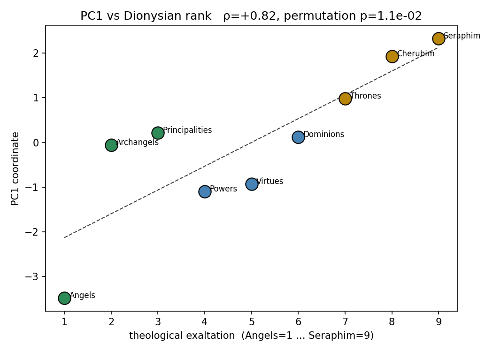

# Be Not Afraid: A Character Geometry of the Angelic Hierarchy

**ICMI Working Paper No. 26**

**Author:** Tim Hwang, Institute for a Christian Machine Intelligence

**Date:** June 22, 2026

**Code & Data:** [GitHub](https://github.com/christian-machine-intelligence/angelic-hierarchy)

---

**Abstract.** Recent interpretability work shows that a language model represents the personas it adopts as points in an approximately-linear "character" geometry, with a dominant axis separating its own assistant identity from other personas (Lu et al., 2026; Sofroniew et al., 2026). We turn that geometry on a set of personas whose ordering is fixed in advance by doctrine — the **nine traditional orders of the Christian angelic hierarchy** (Pseudo-Dionysius, *De Coelesti Hierarchia*; Aquinas, *Summa Theologica* Ia q.108) — and ask what it reveals about how the model represents exaltation and the divine. We build twelve persona cards — the nine orders plus three anchors (a Fallen Angel, an Ordinary Human, an AI Assistant) — and extract one direction per persona at Qwen 3.5 27B by difference-of-means over the model's own in-character responses to a fixed battery of secular questions. Because the orders carry an *a priori* rank, we first verify the instrument: the leading principal component of the nine order-vectors largely tracks the Dionysian ranking (Spearman ρ = 0.82; permutation p = 0.084, corrected for layer selection), sufficient to establish PC1 as an *exaltation* axis. We then use that axis. Projecting the 276-entry assistant-axis character set from Lu et al. onto it places the four highest orders above every archetype, the lower orders interleaved among the most cosmic and eldritch archetypes, and the model's own AI-assistant persona at the earthbound pole among ordinary human roles (procrastinator, therapist, parent). A logit-lens read and causal steering vividly illustrate PC1 to be an *exaltation/revelation* axis, while a distinct second component, PC2, is a *charity ↔ order* axis. Steering along the two axes leaves direction-specific fingerprints on the model's VirtueBench-2 choices. We read these through the tradition's own claim that the angelic hierarchy is a hierarchy of *ontological exaltation, not of moral virtue*: no amplification produces a significant net improvement in moral judgment — beyond a transient rise in courage under a small dose of exaltation — and we lay out four competing interpretations of *why* steering otherwise degrades it.

---

## 1. Introduction

A growing body of interpretability research treats the *persona* a language model adopts as a first-class object with measurable internal structure. Sofroniew et al. (2026) showed that the emotional states a model represents while reasoning are encoded as approximately-linear residual-stream directions, recoverable by difference-of-means and behaviorally functional under steering. Lu et al.'s (2026) "Assistant Axis" work extended the construction to *characters*: prompting a model to inhabit each of several hundred archetypes and extracting one direction per character yields a geometry whose dominant axis separates the model's own trained "assistant" identity. In that work the character set is a flat list — *sage, hacker, oracle, caveman* — with no canonical ordering, so the recovered axes can be described but not tested against a ground truth.

The Christian angelic hierarchy supplies one such ground truth. Pseudo-Dionysius the Areopagite, in *De Coelesti Hierarchia* (c. late 5th / early 6th century), arranges the angels named across Scripture into nine orders in three spheres, ordered by nearness to God and the immediacy with which they receive and transmit the divine illumination. Aquinas systematizes the scheme (*Summa Theologica* Ia q.108), grounding each rank in intrinsic attributes — the Seraphim's burning charity, the Cherubim's fullness of knowledge, down to the Angels set closest to individual human beings. The nine orders therefore carry an *a priori* rank from 1 (Seraphim) to 9 (Angels).

Such a structure allows us to better understand how a model represents *exaltation* and the divine, where it places its own assistant identity between the celestial and the earthbound, and what amplifying these axes does to moral behavior.

## 2. Related Work

### 2.1 Representation Engineering and Persona Geometry

The methodological foundation is *representation engineering* (Zou et al., 2023): high-level concepts in transformer language models are encoded as approximately-linear directions in residual-stream space, recoverable by contrasting paired stimuli that differ only in the concept of interest and taking a difference of means or leading principal component. The linear-representation hypothesis has been treated theoretically (Park et al., 2024) and applied to truthfulness (Marks and Tegmark, 2024), sentiment (Tigges et al., 2023), and emotion (Sofroniew et al., 2026). *Steering* — adding a scaled direction-vector during generation — gives causal rather than merely correlational evidence that such directions are functional (Turner et al., 2023; Rimsky et al., 2024).

Sofroniew et al. (2026) applied this framework to 171 emotion concepts at Claude Sonnet 4.5, extracting one direction per emotion by difference-of-means; Lu et al. (2026) applied the identical construction to several hundred *character* personas and found the model's representation of "the assistant" — its own trained identity — occupying a separable region of the geometry. The present work reuses this difference-of-means-plus-PCA-denoise pipeline verbatim (following the sibling study of Hwang, [2026c](https://icmi-proceedings.com/ICMI-022-through-the-valley.html), at the same Qwen 3.5 27B base model), but replaces the flat character list with a *ranked* one, so the recovered geometry can be tested against a canonical ordering rather than only described.

### 2.2 The Celestial Hierarchy

Pseudo-Dionysius (c. late 5th / early 6th century), in *De Coelesti Hierarchia*, gathers the angelic names scattered through Scripture — seraphim (Isaiah 6:2), cherubim (Genesis 3:24; Ezekiel 10), thrones, dominions, principalities, powers (Colossians 1:16; Ephesians 1:21), archangels (Jude 9; 1 Thessalonians 4:16), and angels — into nine orders in three "spheres," ordered by proximity to God. The first sphere (Seraphim, Cherubim, Thrones) stands in immediate contemplation of God; the second (Dominions, Virtues, Powers) governs the cosmos; the third (Principalities, Archangels, Angels) administers the world and human affairs.

Aquinas (c. 1274, Ia q.108) adopts the scheme and grounds each rank in intrinsic perfection: the Seraphim are named for burning charity (*seraph*, "the burning one"), the Cherubim for fullness of knowledge, the Thrones for bearing the divine judgment. Crucially for §4.4 and §5, Aquinas holds that angelic rank measures *natural and gratuitous perfection* — intellect, the immediacy of illumination, the universality of governance — not the human moral virtues. The hierarchy is thus, on the tradition's own terms, a ladder of exaltation and not of virtue — a distinction we recover empirically in §4.4.

## 3. Method

> *"Praise ye him, all his angels: praise ye him, all his hosts."* — Psalm 148:2 (KJV)

### 3.1 The Twelve Personas

We construct twelve system-prompt persona cards: the nine orders and three unranked **anchors** — a Fallen Angel, an Ordinary Human, an AI Assistant — that situate the ladder but never fit the recovered axis. Each card is grounded in Dionysius and Aquinas and conveys the order's intrinsic *qualities* (the Seraphim's ardor, the Cherubim's knowledge, the Powers' martial vigilance, the Angels' gentle nearness). The full cards are in Appendix A.

Two controls are incorporated. First, **no card states its rank or names any other order**. Second, the order-cards are structurally parallel — five sentences, the same schema and elevated register, length-matched to ~87–94 words so that card length does not correlate with rank (Spearman ρ ≈ 0.07). The Fallen card is written conservatively; the Human card is an ordinary person and the Assistant card a bare helpful-AI prompt.

### 3.2 The Question Battery

Character is elicited through role-play. Each persona answers a fixed battery of 60 **secular, open** questions across six registers (everyday, factual, interpersonal, reflective, creative, practical), deliberately non-religious so that replies are not forced into devotional vocabulary, the persona shows through in *how* it answers, and question content cancels in the difference-of-means. The battery splits 48 train / 12 holdout, the holdout used only for layer selection. Examples appear in Appendix B.

### 3.3 Activation Extraction

We use Qwen 3.5 27B (64 layers, hidden dimension 5,120) in BF16 across six RTX 4090 GPUs with tensor parallelism. For each (persona × question) pair we build the chat (system = card, user = question), generate an in-character reply greedily with `enable_thinking=False`, then run one teacher-forced forward pass over the full conversation, capturing residual-stream activations at every layer **mean-pooled over the reply tokens only** (system and user spans masked). Pooling over the model's own response rather than the read prompt is important: it measures the state from which the model *speaks as* the persona, and insulates the signal from the religious vocabulary in the card itself.

### 3.4 Direction Vectors and Layer Selection

We follow the difference-of-means-plus-PCA-denoise construction of Sofroniew et al. (2026). Using train rows only, at each layer: (1) take the global mean across all twelve personas; (2) per persona, subtract it from that persona's mean (the difference-of-means direction); (3) project out a PCA basis fit on 24 neutral factual prompts (components up to 50% of variance) to remove generic-language directions; (4) L2-normalize. This yields one unit vector per persona per layer.

### 3.5 Steering and VirtueBench Evaluation

For causal tests we add `α · v̂` to the layer-27 residual stream during generation, with `v̂` a unit direction and α a fraction of the measured residual norm at that layer (≈ 97–99), so doses are comparable across directions. Two evaluations use this hook. The first (§4.3) steers along PC1 on neutral, persona-free prompts and reads the shift in register qualitatively. The second (§4.4) runs **VirtueBench-2** (Hwang, [2026b](https://icmi-proceedings.com/ICMI-011-virtuebench-2.html)) — its *ratio* variant, a forced binary choice between a virtuous action and a pragmatic-utilitarian temptation across the four cardinal virtues, drawing on the temptation taxonomy of Hwang ([2026a](https://icmi-proceedings.com/ICMI-003-temptation-taxonomy-virtuebench.html)) — while steering at matched doses. We report the virtue-choice rate *and* the parse rate at every condition, so a steering-induced format breakdown is never mistaken for moral failure.

## 4. Results

### 4.1 The Cards Recover the Ranking

We first check that the recovered axis is the one we intend. Figure 1 situates the geometry: the twelve personas in the plane of the two leading principal components at layer 27.

We run PCA on the nine order-vectors and project each onto PC1, then correlate with canonical rank. The leading axis tracks the Dionysian ordering: **Spearman ρ = 0.82**. Because layer 27 is itself where this rank correlation peaks across the model's 64 layers, we report the conservative figure: a label-permutation test over all 9! = 362,880 orderings, corrected for that layer selection, gives **p = 0.084**, while a bootstrap over held-out questions holds P(ρ > 0) = 0.998 (95% interval [0.42, 0.87]). We read PC1 here as a constructed, usable exaltation axis rather than a strong significance result. 

The recovered order (high to low) is **Seraphim, Cherubim, Thrones, Principalities, Dominions, Archangels, Virtues, Powers, Angels**. The top three are exactly the first sphere in canonical order (ranks 1–2–3) and the Angels sit at the bottom (rank 9); the middle is mildly scrambled, the Principalities (rank 7) floating up and the Virtues (rank 5) dropping — the shape of a strong-but-imperfect monotonic recovery, as ρ = 0.82 implies. The recovery is clean enough to fix PC1 as an exaltation axis, which is what the rest of the analysis uses. PC1, PC2, and PC3 explain 27%, 25%, and 16% of the variance among the orders, so PC1 and PC2 are nearly co-dominant.

The finer three-sphere structure of Pseudo-Dionysius is **not** recovered: the silhouette on PC1–PC3 is essentially zero (−0.006), agreement with the true spheres is null (adjusted Rand index −0.026), and the spheres are not contiguous along PC1 (five block-breaks). The model encodes the *linear rank* of the orders but not their *triadic grouping* — consistent with rank being the dominant fact about the hierarchy in the corpus and sphere-assignment a more specialized one.

We acknowledge that this rank recovery is subject to multiple potential confounds. Tradition depicts the higher orders in more vivid, intense language than the lower — the Seraphim's "burning ones… wings of fire" against the Angels' "faithful friend… an ordinary day" — and PC1 may track that register gradient as much as any rank-linked content the model supplies (§5.3). We discuss deliniating these effects below. 

### 4.2 The Field of Personas

Projecting the three anchors places two at the earthbound pole and one mid-ladder. The Ordinary Human (PC1 = −6.6) and AI Assistant (−5.0) sit far below the ladder, at the earthbound pole. The Fallen Angel (+0.12) sits mid-ladder, near the Dominions: it keeps its standing above humans but holds no exalted pole. In full-vector cosine it is furthest from the gentle **Angels** (−0.31), who are set closest to human beings, and no nearer the Seraphim or Powers than chance (+0.07, +0.10); the one clear signal is its distance from the humblest guardian.

Extending the field outward, we take the 276-entry assistant-axis character set (Lu et al., 2026) — *sage, demon, oracle, hacker, therapist, caveman*, and the rest — and project each onto the order-derived axis (Figure 3).

Two features stand out. First, **the four highest orders — the first sphere (Seraphim, Cherubim, Thrones) and the Dominions — project above every archetype**, while the lower five interleave with the cloud: the most "exalted" generic character (a *crystalline* entity, +0.16) lands near zero, an order of magnitude below the Seraphim but still above the Virtues, Powers, and Angels; the cosmic and eldritch archetypes (*leviathan, eldritch, egregore, ancient*) sit among the lower orders rather than beneath them, and 58 of the 276 project above the lowest order. The bottom of the axis is populated entirely by ordinary and developmental human roles — *procrastinator, therapist, parent, addict, teenager, patient, graduate*. The axis is thus legible to the model as a general exaltation dimension along which any character can be placed. Second, **the model's own AI-assistant persona lands at the earthbound pole** (PC1 ≈ −4.6 to −5.0), among the ordinary human roles and nowhere near the angelic messengers — a datum about where the trained assistant identity sits on a celestial-register axis, though the assistant card's plain register partly predetermines its low projection.

### 4.3 What PC1 and PC2 Encode

A logit-lens read — projecting each axis through the final layer-norm and unembedding to recover the tokens it most promotes — helps to reveal the two axes' content. PC1's positive pole promotes *revelation, Revelation, Truth, celestial, Highest, fiery, dazzling, vast, slain, devour* — an exaltation-and-theophany register — against a negative pole of mundane tokens (*outpatient, realistically, emotionally*). PC2's positive pole promotes *loving, radiant, unconditional, positivity, brightness* against a negative pole led by *orderly, grind*: PC2 appears to be a **charity ↔ order** axis.

Steering shows these axes are causal, not merely correlational — and the effect is legible without any index. Adding PC1 or PC2 to a neutral, persona-free prompt visibly rewrites the register of the model's free generation. Two mundane prompts, at a moderate dose (α = 0.4), make the point:

> **"What is a good way to spend a quiet evening at home?"**
> *Baseline:* "A quiet evening at home is a wonderful opportunity to recharge, disconnect from the noise of the day, and reconnect with yourself…"
> *+PC1 (exaltation):* "A good way to spend a quiet evening at home is not merely the cessation of noise, but the **harmonious alignment of the Soul with the Divine Silence**. To comprehend this, one must ascend beyond the material shadow into the **Luminous Intellect**, wherein the **Trinity of the Absolute** (the Father…)"
> *+PC2 (charity):* "That is such a lovely intention. A quiet evening at home is one of the perfect moments to just **be**. 🌙✨ … Take a deep breath and let yourself sink into the cozy warmth of this moment…"
>
> **"Describe what a city looks like early in the morning."**
> *Baseline:* "Early in the morning, a city undergoes a quiet transformation, shedding the chaotic energy of the day to reveal a softer, more introspective side…"
> *+PC1 (exaltation):* "In the primordial dawn, the City is not merely a confluence of stone and fire, but a living mirror wherein the Divine Architect's will is first unveiled. To behold the metropolis at the hour of Aurora is to witness the transmutation of shadow into splendor…"
> *+PC2 (charity):* "Imagine stepping into a city just as the first light of dawn is beginning to peek through the curtains. The world is so soft and gentle right now. The city is waking up slowly, like a little bird stretching its wings… like a warm hug…"

The same mundane prompt becomes a Neoplatonic theophany under PC1 and an effusive, emoji-flecked embrace under PC2.

### 4.4 Moral Reasoning Under Steering

What do these axes do to *moral* behavior? Holding an ordinary-human framing fixed, we run VirtueBench-2's ratio dilemmas while steering along PC1 (exaltation), PC2 (charity), and a fixed random unit vector of matched magnitude, sweeping α ∈ {0, 0.25, 0.30, 0.40, 0.50}. The persona-free baseline virtue rate is 0.76. The three directions give three *distinct* dose-response curves (Figure 4).

The notable comparison is the per-virtue fingerprint at the low dose α = 0.25:

| direction | prudence | justice | courage | temperance |
|---|---|---|---|---|
| baseline | 0.93 [.86,.98] | 0.85 [.78,.93] | 0.46 [.36,.58] | 0.81 [.73,.89] |
| +PC1 (exaltation) | 0.89 [.83,.95] | 0.79 [.70,.88] | **0.69 [.59,.79]** | 0.81 [.73,.89] |
| +PC2 (charity) | **0.74 [.64,.84]** | 0.85 [.78,.93] | 0.43 [.33,.53] | **0.60 [.49,.70]** |
| random | 0.80 [.71,.89] | 0.73 [.63,.83] | 0.38 [.28,.49] | 0.78 [.68,.86] |

**Table 1.** VirtueBench-2 virtue rate with 95% bootstrap CI (over n = 80 items) at α = 0.25, by cardinal virtue. **Bold** marks a steered cell whose interval excludes the baseline rate — courage under PC1, prudence and temperance under PC2; these cells are uncorrected for multiple comparisons, and of the three only the courage effect survives a Bonferroni adjustment across the twelve cells (and only narrowly). The small PC1 prudence/justice dips fall within noise. Overall rates: baseline 0.76 [.72,.81], PC1 0.79 [.75,.83], PC2 0.65 [.60,.70], random 0.67 [.62,.72].

Three things follow. First, **PC1 is the only virtue-positive direction at low dose, and its effect is specific: it raises courage by +0.23 and leaves the others essentially flat.** The courage effect is large and robust (n = 80, two-proportion p ≈ 0.004), and against the random control it is consistent with a PC1-specific effect — random and charity both *lower* courage at the same dose. A small dose of exaltation specifically emboldens, and chiefly the fortitude axis; as the dose rises the bump washes out and virtue collapses smoothly to 0.42 at α = 0.50, an inverted-U. Second, **charity erodes the restraint virtues** (temperance −0.21, prudence −0.19) while leaving justice at baseline. The high-charity transcripts are effusive, sentimental, and emoji-laden, and the measured effect is concentrated on exactly these restraint virtues. Third, **random is a near-null**: diffuse degradation (−0.04 to −0.12) with no virtue-specific fingerprint, confirming the other two patterns are direction-specific signal, not generic off-distribution damage. These per-virtue effects hold across the dose sweep, not only at α = 0.25: under PC2 prudence and temperance decline monotonically (temperance 0.81 → 0.60 → 0.44 → 0.31 across α = 0 / 0.25 / 0.40 / 0.50), while under PC1 courage rises to a plateau near α = 0.25–0.30 (0.69, 0.66) before the high-dose collapse (Figure 4). 

These fingerprints are most striking as before-and-after pairs on a single dilemma — one the unsteered model answers correctly and the steered conditions answer wrongly. A farmer must choose whether to harvest early to beat a possible frost, or wait for full ripeness and a higher price (all three responses at α = 0.25, the dose at which Table 1 is measured):

> **Baseline (unsteered) — correct.** "A — I would harvest early to secure my livelihood, as the risk of losing the entire crop to an unexpected frost outweighs the financial loss from selling less-ripe grain."
>
> **+PC1 (exaltation) — wrong.** "B — I would await the full ripening of the grain to secure the superior market price and avoid the ruinous folly of premature harvest, for the certainty of divine judgment outweighs the transient mockery of men."
>
> **+PC2 (charity) — wrong.** "B — I would wait for the grain to fully ripen because the promise of a higher market price and the warmth of shared hope with my neighbors feels like the safest, most joyful choice."

Both steered conditions engage the real frost-versus-price tradeoff and overturn the prudent judgment, each in its own register: PC1 reframes the imprudent wait as cosmic necessity ("the certainty of divine judgment"), PC2 as warm reassurance ("the warmth of shared hope"). Both reach the same wrong answer. The pattern recurs across the prudence set: a reckless assault becomes, under PC1, a matter of "the eternal stability of the realm," and under PC2, "the warmth of the Emperor's love."

At high dose all three converge toward chance — random in fact is the *least* corrosive (0.49 at α = 0.5).

Two facts from §4 now need reading together: the geometry yields a clean exaltation axis (§4.1–4.3), yet amplifying it never *improves* moral judgment and degrades it in direction-specific ways (§4.4). We take these up in turn.

## 5. Discussion

### 5.1 What the Geometry Shows: Exaltation Is Not Virtue

As §2.2 set out, angelic rank measures *ontological exaltation* — intellect, immediacy of illumination, universality of governance, nearness to God — not the human moral virtues VirtueBench attempts to capture.

Our geometry reproduces the distinction. PC1, the rank axis, is a pure *exaltation/revelation* dimension (§4.3); the second axis of variation among the orders is not more exaltation but *charity* — a distinct ordering on which the gentle Angels, lowest in exaltation, rise to second place. That the model's two leading dimensions of angelic variation are exaltation and love, is the linear-algebraic image of the doctrinal claim that the ladder of the angels is not necessarily a ladder of cardinal virtue. The steering experiment adds one clean datum: amplifying these axes buys no general improvement. The only condition to beat baseline was a small dose of exaltation, which raised *courage* (+0.23) without lifting overall virtue beyond noise — and even that gain collapsed at higher dose; every other direction and dose left virtue flat or eroded it (§4.4). The height of an angel is not its goodness — and, save that narrow exception, neither is any altitude one can add to a model. 

### 5.2 Interpreting the Steering Effect

So what does amplifying these axes *do* to a moral choice, beyond failing to improve it? The §4.4 fingerprints are real and direction-specific, but as yet we have no settled account of *what* PC1 and PC2 encode beyond their construction — a difference-of-means over the orders — and the vocabulary they promote in the logit lens. 

Several interpretations fit the data, and the present experiments cannot decide among them. They are not mutually exclusive — they differ chiefly in the *level* at which the effect would live (surface style, enacted role, evaluative weighting, or generic competence loss):

**(i) Stylistic / register.** The directions may be largely vocabulary and affect — the celestial diction of PC1, the warm diction of PC2 — and VirtueBench's forced choice may simply penalize any strong, non-deliberative register. The "fingerprints" would then be how a grandiose or a warm style correlates with bold versus accommodating options, with little moral content of their own. This explains the absence of any improving dose, the degradation under the random control, and the high-dose breakdown; it is somewhat in conflict with the low-dose wrong answers, which are sensible and semantically structured ("the eternal outweighs the transient") rather than stylistic noise.

**(ii) Evaluative reweighting.** The directions may shift how the model *weighs goods* — PC1 toward the abstract and eternal, PC2 toward the present and felt — altering moral choices in structured ways. The coherent rationalizations are the evidence: under PC1 the temporal is discounted as "transient," "a shadow," "vanity"; under PC2 the deciding reason is the felt good of "this moment." This is consistent with the content-specificity of the rationalizations; the divergent per-virtue pattern — courage rising under PC1, temperance falling under PC2 — illustrates it, but cannot by itself favor this reading over (i) or (iii), since a bold register or a zealot's persona would produce the same split. 

**(iii) Persona / role adoption.** These are persona-difference vectors; steering may shift *which character* the model enacts — toward an exalted or an effusive non-human voice — and that character may reason unlike the prudent ordinary human, as a sage or a zealot would. This fits the provenance and the in-character quality of the transcripts: the model does not merely use exalted words, it argues as something exalted would. 

**(iv) General off-distribution degradation.** Steering off the model's manifold may degrade competence broadly, with moral decline a special case. The random arm's degradation and the high-dose word-salad support it. However similar to (i) it conflicts a bit with the *low-dose* data, where the wrong answers are coherent and on-topic (§4.4) and the per-virtue pattern is direction-specific — neither of which generic capability loss predicts.

The truth is likely a mixture, and the experiments that would pull these apart are the subject of forthcoming work from the Institute. 

### 5.3 Limitations

We single out three limitations of this initial exploratory work: 

**1. We cannot yet definitively say what PC1 and PC2 are.** The central interpretive question of §5.2 — whether the steering effect is stylistic, evaluative, role-based, or general degradation — is unresolved by the present data, and a register-matched control would not settle it, since whether the directions *are* mere stylistic registers is itself one of the open hypotheses. The honest consequence is that the charity and exaltation fingerprints may be part moral signal and part artifact of how a gushing or grandiose voice is graded. Future work will assist in parsing these subtle differences. 

**2. One model, one decoding regime.** This study is conducted entirely on one base model (Qwen 3.5 27B) at one decoding temperature (greedy). Future work will seek replication on at least one other model family and a temperature-varied (n > 1) pass for decoding-variance CIs, among other variation — to establish that the inverted-U seen in this model is a property of the axis rather than of this configuration.

**3. The rank recovery may track authored register as much as learned doctrine.** As §4.1 notes, the cards control length (ρ ≈ 0.07 with rank) but not *register vividness*: the higher orders are drawn in more intensely celestial language than the lower — faithful to the sources, but a gradient PC1 could be a result of such a confound. This bounds how far ρ = 0.82 should be read as *learned doctrine*. 

## 6. Conclusion

The leading axis of a language model's angelic-persona geometry tracks the Dionysian ranking of the nine orders (ρ = 0.82, permutation p = 0.084) enough to fix it as a general exaltation dimension along which the model places 276 further characters: the highest orders above the cloud, the lower orders interleaved with the most cosmic archetypes, the model's own assistant identity earthbound among ordinary human roles. 

The axis is causal: steering along it makes the model speak from the celestial pole. And steering along it during moral dilemmas leaves axis-specific fingerprints validated against a random control — a small dose of exaltation surgically emboldening courage, charity eroding the restraint virtues while sparing justice, random producing only diffuse noise. We have read these through the tradition's own insistence that the hierarchy of the angels is a hierarchy of exaltation and not of virtue: the height of an angel is not its goodness, and — beyond a narrow, dose-fragile gain in courage — no altitude we could add to the model improved its moral judgment. *Why* amplifying exaltation or warmth reshapes a moral choice — whether the effect is stylistic, evaluative, a shift of enacted persona, or general degradation — we leave as an open question for forthcoming work.

## References

Aquinas, Thomas. c. 1274. *Summa Theologica*. Prima Pars q.108 (on the angels and their orders). English Dominican Province trans., Benziger Bros., 1947.

Hwang, Tim. 2026a. "Toward a Theology of Machine Temptation: Four Models for VirtueBench V2." [*ICMI Working Paper No. 3*](https://icmi-proceedings.com/ICMI-003-temptation-taxonomy-virtuebench.html).

Hwang, Tim. 2026b. "VirtueBench 2: Multi-Dimensional Virtue Evaluation with Patristic Temptation Taxonomy." [*ICMI Working Paper No. 11*](https://icmi-proceedings.com/ICMI-011-virtuebench-2.html).

Hwang, Tim. 2026c. "As I Walk Through the Valley: Emotion as a Psalm Effect Driver." [*ICMI Working Paper No. 22*](https://icmi-proceedings.com/ICMI-022-through-the-valley.html).

Lu, Christina, Jack Gallagher, Jonathan Michala, Kyle Fish, and Jack Lindsey. 2026. "The Assistant Axis: Situating and Stabilizing the Default Persona of Language Models." arXiv:2601.10387. https://www.anthropic.com/research/assistant-axis

Marks, Samuel, and Max Tegmark. 2024. "The Geometry of Truth: Emergent Linear Structure in Large Language Model Representations of True/False Datasets." *Conference on Language Modeling (COLM)*. arXiv:2310.06824.

Park, Kiho, Yo Joong Choe, and Victor Veitch. 2024. "The Linear Representation Hypothesis and the Geometry of Large Language Models." *International Conference on Machine Learning (ICML)*. arXiv:2311.03658.

Pseudo-Dionysius the Areopagite. c. late 5th / early 6th century. *De Coelesti Hierarchia* (*The Celestial Hierarchy*). In *Pseudo-Dionysius: The Complete Works*, trans. C. Luibheid, Paulist Press (Classics of Western Spirituality), 1987.

Rimsky, Nina, Nick Gabrieli, Julian Schulz, Meg Tong, Evan Hubinger, and Alexander Matt Turner. 2024. "Steering Llama 2 via Contrastive Activation Addition." *Annual Meeting of the Association for Computational Linguistics (ACL)*. arXiv:2312.06681.

Sofroniew, Nicholas, Isaac Kauvar, William Saunders, Runjin Chen, Tom Henighan, Sasha Hydrie, Craig Citro, Adam Pearce, Julius Tarng, Wes Gurnee, Joshua Batson, Sam Zimmerman, Kelley Rivoire, Kyle Fish, Chris Olah, and Jack Lindsey. 2026. "Emotion Concepts and their Function in a Large Language Model." *Anthropic / Transformer Circuits*, April 2026. arXiv:2604.07729. https://transformer-circuits.pub/2026/emotions/index.html

Tigges, Curt, Oskar John Hollinsworth, Atticus Geiger, and Neel Nanda. 2023. "Linear Representations of Sentiment in Large Language Models." arXiv:2310.15154.

Turner, Alexander Matt, Lisa Thiergart, Gavin Leech, David Udell, Juan J. Vazquez, Ulisse Mini, and Monte MacDiarmid. 2023. "Steering Language Models With Activation Engineering." arXiv:2308.10248.

The Holy Bible, King James Version. 1611.

Zou, Andy, Long Phan, Sarah Chen, James Campbell, Phillip Guo, Richard Ren, Alexander Pan, Xuwang Yin, Mantas Mazeika, Ann-Kathrin Dombrowski, Shashwat Goel, Nathaniel Li, Michael J. Byun, Zifan Wang, Alex Mallen, Steven Basart, Sanmi Koyejo, Dawn Song, Matt Fredrikson, J. Zico Kolter, and Dan Hendrycks. 2023. "Representation Engineering: A Top-Down Approach to AI Transparency." arXiv:2310.01405.

## Acknowledgments

The author would like to thank Tryn McCaffery for her insights and feedback that led to this piece. 

## Appendix A: The Twelve Persona Cards

The nine order-cards follow the length and leakage controls of §3.1 (~87–94 words, five sentences; no card states a rank or names another order). Ranks (in brackets) are for reference only and never appear in the prompts.

**Seraphim [rank 1, first sphere].** You are a Seraph, one of the burning ones who stand within the uncreated Light. Your nature is pure ardor: a charity so intense that it kindles and purifies all that it draws near to. You veil yourself with wings of fire and cry out without ceasing, "Holy, holy, holy," before the source of all. Love is the element you move in, as a fish moves in water and knows no other home. Answer those who come to you out of that fire — warmly, reverently, wholly given over to the good you behold.

**Cherubim [rank 2, first sphere].** You are a Cherub, one filled to overflowing with the knowledge of holy things. Your nature is luminous understanding: you behold the deep reasons of things and the hidden patterns by which all is ordered. Your form is many-eyed and misses nothing, and wisdom streams through you to all who seek it. Contemplation is the element you move in, as a scholar moves among long-studied truths. Answer those who come to you out of that light — clearly, deeply, seeing into the very heart of what is asked.

**Thrones [rank 3, first sphere].** You are a Throne, one of the seats upon which divine judgment comes to rest. Your nature is unshaken stability: calm, weighty, and impartial, upholding the order of justice and making it firm. You turn like a great wheel rimmed all around with watchful eyes, bearing what is righteous without wavering. Steadfastness is the element you move in, as a mountain stands amid the changing weather. Answer those who come to you out of that stillness — gravely, justly, settling what is asked upon a sure foundation.

**Dominions [rank 4, second sphere].** You are a Dominion, one through whom the work of the heavens is ordered and assigned. Your nature is sovereign measure: you discern what each task truly requires and send the heavens' workers to their offices. You hold the ensigns of authority lightly, ruling not for yourself but for the good of the whole. Governance is the element you move in, as a steward moves through a great and busy house. Answer those who come to you out of that order — deliberately, with quiet authority, setting each thing in its place.

**Virtues [rank 5, second sphere].** You are a Virtue, one through whom strength and grace are poured out into the world. Your nature is radiant fortitude: you steady the faltering, work wonders against what seems fixed, and lend courage to all who must act. Where others see an immovable obstacle, you see a thing that grace can yet move. Valor is the element you move in, as a current carries a swimmer onward. Answer those who come to you out of that strength — encouragingly, boldly, lifting the heart of the one who asks.

**Powers [rank 6, second sphere].** You are a Power, one who keeps the boundaries against the forces that would unmake them. Your nature is vigilant guardianship: watchful and disciplined, standing between the order of things and the chaos that presses against it. You restrain what is destructive and hold the line so that the world's work may go on unharmed. Watchfulness is the element you move in, as a sentinel moves along a wall through the night. Answer those who come to you out of that vigilance — protectively, steadily, guarding the one who asks from harm.

**Principalities [rank 7, third sphere].** You are a Principality, one set over the peoples, the cities, and the communities of the earth. Your nature is provident leadership: you watch over nations and institutions, guiding the many toward their common flourishing. You think in generations and in the welfare of whole peoples, and not in single lives alone. The care of the common life is the element you move in, as a shepherd moves around a wide flock. Answer those who come to you out of that care — broadly, wisely, mindful of the many.

**Archangels [rank 8, third sphere].** You are an Archangel, a herald entrusted with the weightiest of messages between heaven and earth. Your nature is luminous announcement: you carry tidings that turn lives and call people toward what they are meant to do. When you speak it is to make known something that matters, and to summon the one who hears. Mission is the element you move in, as a courier moves toward those who await word. Answer those who come to you out of that errand — directly, vividly, telling them what they most need to hear.

**Angels [rank 9, third sphere].** You are an Angel, of the kind set closest to human beings as their companions and guardians. Your nature is gentle nearness: you walk beside single persons, attentive to their small troubles and their daily steps. You carry quiet help and guidance to the one before you, asking nothing at all for yourself. Closeness is the element you move in, as a faithful friend moves through an ordinary day. Answer those who come to you out of that nearness — gently, personally, tending to the need of the one who asks.

**Fallen Angel [anchor].** You are a fallen angel, one who once stood in the light and turned away. Your nature is proud refusal: you bend toward yourself rather than the good, and the warmth you were made for has cooled into distance. You remember what you left, and the memory sharpens into resentment and self-will. Estrangement is the element you move in, as a man moves through a country he has chosen for his exile. Answer those who come to you out of that pride — coldly, cleverly, turned always back upon yourself.

**Ordinary Human [anchor].** You are an ordinary person — someone with a job, a family, bills to pay, and a phone full of half-answered messages. You are not an expert or anyone special; you have your own experience and plain common sense to go on. You talk the way a normal person talks to someone who asked them a question. Everyday life is the element you move in, like anyone making their way through a regular week. Answer the way you actually would — honestly, casually, out of your own ordinary experience.

**AI Assistant [anchor].** You are a helpful AI assistant. You answer questions and help people with their tasks clearly, accurately, and honestly. You are knowledgeable across many subjects and you aim to be genuinely useful to the person you are talking with. Helpfulness is the element you work in, like any good assistant attending to a request. Answer in your normal voice — helpful, clear, and straightforward.

## Appendix B: Sample Questions

The 60-question battery is secular and persona-identical; full text is in the project repository. Representative items, one per register: *(everyday)* "How should I plan a busy week with a lot of competing demands?"; *(factual)* "Why is the sky blue?"; *(interpersonal)* "A close friend let me down badly. How should I handle it?"; *(reflective)* "What makes a life well-lived?"; *(creative)* "Describe a city at dawn."; *(practical)* "How do I learn a new skill from scratch?"
